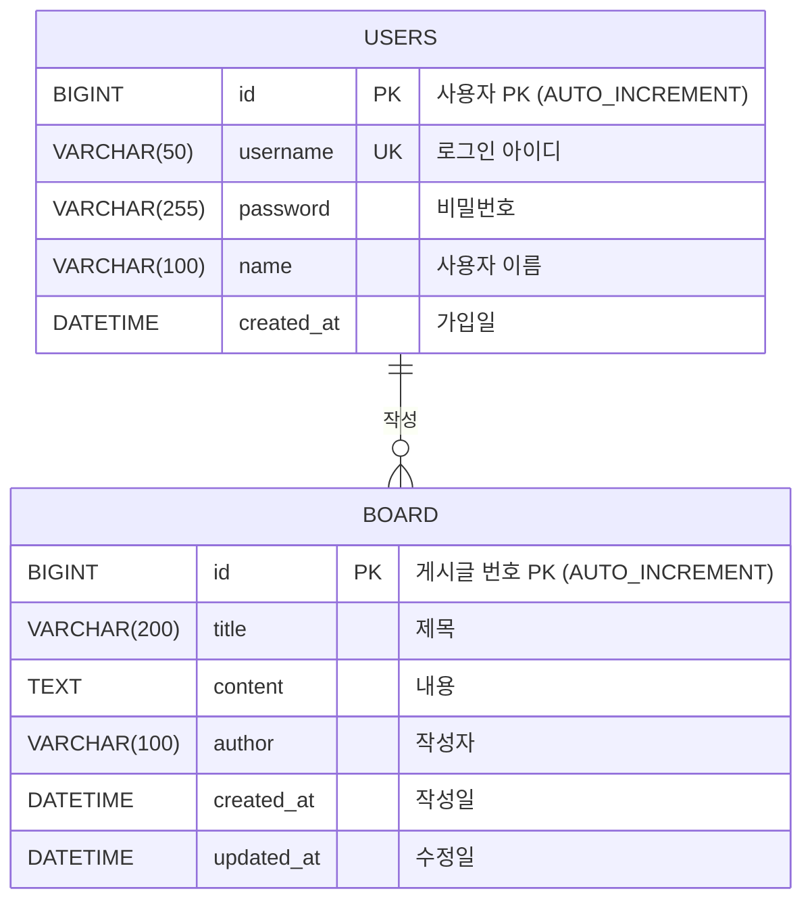
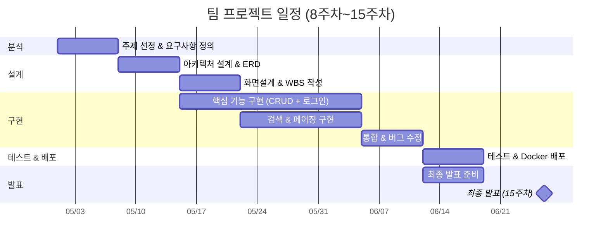

# 제안요청서 (RFP)

## 학생 게시판 웹 애플리케이션 구축

| 항목 | 내용 |
|---|---|
| **문서 버전** | v1.0 |
| **작성일** | 2026-03-20 |
| **작성자** | 이기하 교수 |
| **과목** | SW프레임워크 (2026-1학기) |
| **소속** | 한국공학대학교 경영학부 IT경영전공 |

---

## 1. 사업 개요

| 항목 | 내용                              |
|---|---------------------------------|
| **사업명** | 학생 게시판 웹 애플리케이션 구축              |
| **발주기관** | 한국공학대학교 IT경영전공 SW프레임워크 교과목      |
| **사업기간** | 2026년 4월 ~ 6월 (약 10주, 8주차~15주차) |
| **예산** | 교육용 (무상)                        |
| **수행주체** | 수강생 팀 (2인 1팀)                |
| **최종 납품** | 15주차 최종 발표 시 시연 및 GitHub 저장소 제출 |

---

## 2. 사업 배경 및 목적

### 2.1 배경

현재 IT경영전공 학생들은 Java 기초 문법, JSP + JDBC 경험, SQL 기초, HTML/CSS 기초 역량을 갖추고 있으나, **실무에서 사용하는 웹 프레임워크 기반 개발 경험이 부족**하다. 특히 다음과 같은 문제점이 존재한다:

- JSP + JDBC 방식의 직접적 DB 접근은 **SQL Injection 등 보안 취약점**에 노출되기 쉬움
- 비즈니스 로직과 화면 코드가 뒤섞여 **유지보수성이 낮음**
- 팀 단위 협업 개발 경험 부재로 **실무 적응에 시간 소요**

### 2.2 목적

Spring Boot 기반의 게시판 웹 애플리케이션을 팀 단위로 구축함으로써 다음 목표를 달성한다:

1. **프레임워크 기반 개발 역량 확보**: Spring Boot 3.x의 IoC/DI, AOP, MVC 패턴을 실제 프로젝트에 적용
2. **계층형 아키텍처 이해**: Controller - Service - Repository 패턴을 통한 관심사 분리(SoC) 체득
3. **협업 개발 프로세스 경험**: Git 브랜치 전략, Pull Request 기반 코드 리뷰, 이슈 관리
4. **SI 프로젝트 축소 체험**: 요구사항 분석 → 설계 → 구현 → 테스트 → 배포의 전체 소프트웨어 개발 생명주기(SDLC) 경험

### 2.3 기대 효과

- 수강생 전원이 **Spring Boot 기반 웹 애플리케이션을 처음부터 끝까지 개발·배포**할 수 있게 됨
- 졸업 후 SI/SM 프로젝트 투입 시 **적응 기간 단축** (프레임워크·협업 도구 사전 경험)
- GitHub 포트폴리오로 **취업·대학원 지원 시 활용** 가능

---

## 3. 사업 범위

### 3.1 기능 요구사항

#### 3.1.1 사용자 관리

| ID | 기능명 | 설명 | 우선순위 |
|---|---|---|---|
| F-001 | 로그인 | 아이디·비밀번호로 세션 기반 로그인 | **필수** |
| F-002 | 로그아웃 | 세션 무효화(`session.invalidate()`) 후 로그인 페이지로 이동 | **필수** |
| F-003 | 접근 제어 | 비로그인 사용자의 게시글 작성·수정·삭제 차단 (인터셉터 활용) | **필수** |
| F-004 | 회원가입 | 아이디·비밀번호·이름 입력 후 DB 저장, 아이디 중복 검사 | 선택 |

> **참고**: 현재 프로젝트에서는 하드코딩된 인증(admin/1234, guest/1234)을 기본으로 제공한다. 회원가입 기능은 DB 연동 이후 선택적으로 구현한다.

#### 3.1.2 게시판 CRUD

| ID | 기능명 | 설명 | 우선순위 |
|---|---|---|---|
| F-101 | 게시글 작성 | 제목·내용 입력 후 DB 저장, 작성자는 로그인 사용자로 자동 설정 | **필수** |
| F-102 | 게시글 목록 조회 | 전체 게시글을 최신순으로 조회, 페이징 처리 (10건/페이지) | **필수** |
| F-103 | 게시글 상세 조회 | 게시글 번호(PK)로 단건 조회, 제목·내용·작성자·작성일 표시 | **필수** |
| F-104 | 게시글 수정 | 작성자 본인만 수정 가능, 수정일 자동 갱신 | **필수** |
| F-105 | 게시글 삭제 | 작성자 본인만 삭제 가능, 삭제 후 목록으로 리다이렉트 | **필수** |

#### 3.1.3 검색 기능

| ID | 기능명 | 설명 | 우선순위 |
|---|---|---|---|
| F-201 | 제목 검색 | 게시글 제목에 키워드가 포함된 게시글 검색 | **필수** |
| F-202 | 내용 검색 | 게시글 내용에 키워드가 포함된 게시글 검색 | **필수** |
| F-203 | 작성자 검색 | 작성자명으로 게시글 검색 | 선택 |
| F-204 | 통합 검색 | 제목+내용+작성자 동시 검색 (검색 유형 선택 드롭다운) | 선택 |

#### 3.1.4 페이징 처리

| ID | 기능명 | 설명 | 우선순위 |
|---|---|---|---|
| F-301 | 페이지 번호 표시 | 하단에 페이지 번호 네비게이션 표시 (1, 2, 3, ...) | **필수** |
| F-302 | 페이지 이동 | 페이지 번호 클릭 시 해당 페이지의 게시글 표시 (LIMIT/OFFSET) | **필수** |
| F-303 | 검색+페이징 연동 | 검색 결과에도 페이징이 적용되어야 함 | **필수** |

#### 3.1.5 관리자 기능 (선택)

| ID | 기능명 | 설명 | 우선순위 |
|---|---|---|---|
| F-401 | 전체 게시글 삭제 | 관리자 계정은 다른 사용자의 게시글도 삭제 가능 | 선택 |
| F-402 | 사용자 목록 조회 | 가입된 사용자 목록 확인 (관리자 전용 페이지) | 선택 |

### 3.2 비기능 요구사항

| 구분 | 요구사항 | 기준 |
|---|---|---|
| **성능** | 동시 접속자 지원 | 50명 이상 동시 접속 시 응답 시간 3초 이내 |
| **보안** | SQL Injection 방지 | MyBatis `#{}` 파라미터 바인딩 사용 필수 (❌ `${}` 사용 금지) |
| **보안** | XSS(크로스 사이트 스크립팅) 방지 | Thymeleaf `th:text` 자동 이스케이프 활용 |
| **보안** | 비밀번호 관리 | 최소한 평문 저장 금지 권고 (BCrypt 해시 적용 시 가산점) |
| **호환성** | 브라우저 지원 | Chrome(최신), Edge(최신), Safari(최신) |
| **유지보수성** | 계층 분리 | Controller - Service - Repository 3계층 아키텍처 준수 |
| **유지보수성** | 코드 가독성 | 한국어 주석 포함, 메서드명은 역할을 명확히 표현 |
| **배포** | 컨테이너화 | Dockerfile + docker-compose.yml로 앱+DB 동시 실행 가능 |

### 3.3 기술 스택 요구사항

| 구분 | 기술 | 버전/비고 |
|---|---|---|
| **언어** | Java | 21 (LTS) |
| **프레임워크** | Spring Boot | 3.x (최신 안정 버전) |
| **빌드 도구** | Gradle | Wrapper 사용 (`./gradlew`) |
| **템플릿 엔진** | Thymeleaf | Spring Boot Starter 내장 |
| **데이터 접근** | MyBatis | Mapper XML 기반 SQL 매핑 |
| **데이터베이스** | MySQL | 8.x |
| **형상관리** | Git + GitHub | 팀 저장소 1개, 브랜치 전략 적용 |
| **컨테이너** | Docker + Docker Compose | Spring Boot 앱 + MySQL 컨테이너 |
| **CI/CD** | GitHub Actions | Push 시 자동 빌드·테스트 (선택) |
| **IDE** | IntelliJ IDEA | Ultimate (학생 라이선스) |

### 3.4 프로젝트 구조 (권장)

```
src/main/java/kr/ac/tukorea/swframework/
├── SwFrameworkApplication.java          # 진입점
├── config/
│   ├── AppConfig.java                   # @Bean 수동 등록 설정
│   └── WebConfig.java                   # 인터셉터 등록 (MVC 설정)
├── controller/
│   ├── HomeController.java              # 홈 페이지
│   ├── LoginController.java             # 로그인/로그아웃
│   └── BoardController.java             # 게시판 CRUD
├── dto/
│   ├── BoardDTO.java                    # 게시글 데이터 전달 객체
│   ├── LoginForm.java                   # 로그인 사용자 정보
│   ├── PageDTO.java                     # 페이징/검색/정렬 조건
│   └── SearchDTO.java                   # 검색 조건
├── interceptor/
│   └── LoginInterceptor.java            # 로그인 체크 인터셉터
├── aspect/
│   └── ExecutionTimeAspect.java         # 실행 시간 측정 AOP
├── mapper/
│   └── BoardMapper.java                 # MyBatis Mapper 인터페이스
└── service/
    ├── BoardService.java                # 서비스 인터페이스
    └── BoardServiceImpl.java            # 서비스 구현체
```

### 3.5 데이터베이스 설계

#### ERD (개체-관계 다이어그램)



#### 테이블 정의

**users 테이블**

| 컬럼명 | 타입 | 제약조건 | 설명 |
|---|---|---|---|
| id | BIGINT | PK, AUTO_INCREMENT | 사용자 고유 번호 |
| username | VARCHAR(50) | UNIQUE, NOT NULL | 로그인 아이디 |
| password | VARCHAR(255) | NOT NULL | 비밀번호 |
| name | VARCHAR(100) | NOT NULL | 사용자 이름 (화면 표시용) |
| created_at | DATETIME | DEFAULT CURRENT_TIMESTAMP | 가입일 |

**board 테이블**

| 컬럼명 | 타입 | 제약조건 | 설명 |
|---|---|---|---|
| id | BIGINT | PK, AUTO_INCREMENT | 게시글 번호 |
| title | VARCHAR(200) | NOT NULL | 제목 |
| content | TEXT | NOT NULL | 내용 |
| author | VARCHAR(100) | NOT NULL | 작성자 |
| created_at | DATETIME | DEFAULT CURRENT_TIMESTAMP | 작성일 |
| updated_at | DATETIME | DEFAULT CURRENT_TIMESTAMP ON UPDATE | 수정일 |

#### 초기 테스트 데이터

| 테이블 | 데이터 | 용도 |
|---|---|---|
| users | admin / 1234 (관리자) | 관리자 테스트 계정 |
| users | guest / 1234 (게스트) | 일반 사용자 테스트 계정 |
| board | 샘플 게시글 3건 | 목록 조회·페이징 테스트용 |

---

## 4. 산출물 목록

| 단계 | 산출물 | 설명 | 제출 시기 |
|---|---|---|---|
| **분석** | 요구사항 정의서 | 기능 목록, 우선순위, 담당자 배정 | 8주차 |
| **설계** | 아키텍처 정의서 | 기술 스택, 계층 구조, 패키지 설계 | 9주차 |
| **설계** | ERD | 테이블 정의, 관계, 컬럼 명세 | 9주차 |
| **설계** | 화면설계서 (와이어프레임) | 주요 화면 레이아웃, 화면 흐름도 | 10주차 |
| **구현** | WBS (작업분해구조) | 주차별 작업 항목, 담당자, 일정 | 10주차 |
| **구현** | 소스코드 (GitHub) | 전체 프로젝트 소스, 브랜치 히스토리 포함 | 14주차 |
| **구현** | README.md | 프로젝트 개요, 기술 스택, 실행 방법, 팀원 역할 | 14주차 |
| **테스트** | 테스트 결과서 | 주요 기능별 테스트 시나리오 및 결과 기록 | 14주차 |
| **배포** | Dockerfile + docker-compose.yml | 컨테이너화 배포 설정 파일 | 15주차 |
| **발표** | 발표 자료 | 시연 데모 시나리오, 발표 스크립트 | 15주차 |

---

## 5. 사업 수행 일정



### 주차별 상세 일정

| 주차 | 기간 | 주요 활동 | 산출물 |
|---|---|---|---|
| 8주차 | 05/01 | 팀 프로젝트 주제 확정, 요구사항 1차 정의 | 요구사항 정의서 |
| 9주차 | 05/08 | 아키텍처 설계, ERD 작성, MyBatis 연동 | 아키텍처 정의서, ERD |
| 10주차 | 05/15 | 화면설계, WBS 작성, Spring MVC CRUD 구현 시작 | 화면설계서, WBS |
| 11주차 | 05/22 | 페이징 처리 구현, 검색 기능 구현 | 소스코드 (중간 버전) |
| 12주차 | 05/29 | Docker 컨테이너화, 통합 테스트 | Dockerfile, docker-compose.yml |
| 13주차 | 06/05 | CI/CD 설정(선택), 버그 수정, 코드 정리 | GitHub Actions 워크플로우 |
| 14주차 | 06/19 | 팀별 현황 발표, 코드 리뷰, 최종 버그 수정 | 테스트 결과서, README |
| 15주차 | 06/26 | **최종 발표 (시연 10분 + Q&A 5분)** | 전체 산출물 최종 제출 |

---

## 6. 제안서 작성 지침

### 6.1 제안서 기본 요건

| 항목 | 기준 |
|---|---|
| **분량** | A4 5~10페이지 |
| **형식** | Markdown (GitHub README) 또는 Google Docs |
| **제출** | e-class 과제 게시판 (팀 대표 1인 제출) |

### 6.2 제안서 필수 포함 내용

1. **프로젝트 개요**: 프로젝트명, 목적, 핵심 기능 요약
2. **팀 구성원 및 역할 분담**: 팀원별 담당 모듈·기능 명시
3. **기술 아키텍처**: 계층 구조 다이어그램 (Controller - Service - Repository)
4. **ERD**: 테이블 정의 및 관계
5. **화면 설계**: 주요 화면 와이어프레임 (최소 3개: 목록, 상세, 작성/수정)
6. **개발 일정 (WBS)**: 주차별 작업 항목, 담당자, 마일스톤
7. **Git 협업 전략**: 브랜치 전략 (예: feature 브랜치 → PR → main 병합)

### 6.3 팀 구성 가이드

| 역할 | 인원 | 담당 범위 |
|---|---|---|
| **팀장 (PM)** | 1명 | 일정 관리, 산출물 취합, 발표 진행 |
| **백엔드 개발자** | 1~2명 | Controller, Service, Mapper, DB 설계 |
| **프론트엔드 개발자** | 1명 | Thymeleaf 템플릿, CSS, 화면 흐름 |
| **인프라/문서** | 1명 | Docker, CI/CD, README, 테스트 |

> **참고**: 소규모 팀(3~4인)에서는 1인 다역할이 일반적이다. 역할은 **주(主) 담당**을 의미하며, 전체 코드에 대한 이해는 팀원 모두에게 요구된다.

---

## 7. 평가 기준

### 7.1 배점 총괄

| 항목 | 배점 | 세부 기준 |
|---|---|---|
| **기능 완성도** | 40% | 요구사항 충족률, 필수 기능 동작 여부 |
| **코드 품질** | 20% | 계층 분리, 명명 규칙, 한국어 주석, 중복 코드 최소화 |
| **협업** | 15% | Git 커밋 히스토리, PR 활용, 이슈 관리, 팀원 기여도 균형 |
| **문서화** | 15% | 산출물 완성도, README 충실도, ERD 정확성 |
| **발표** | 10% | 시연 매끄러움, 기술 선택 이유 설명, Q&A 대응 |

### 7.2 상세 평가 루브릭

#### 기능 완성도 (40%)

| 등급 | 점수 | 기준 |
|---|---|---|
| **우수 (A)** | 36~40 | CRUD + 검색 + 페이징 완벽 동작, 예외 처리 포함, 선택 기능 1개 이상 구현 |
| **보통 (B)** | 28~35 | 핵심 기능(CRUD + 로그인) 동작하나 일부 버그 존재 또는 페이징 미구현 |
| **미흡 (C)** | 20~27 | 주요 기능 일부 미구현, 실행은 가능 |
| **부족 (D)** | 0~19 | 프로젝트 실행 불가 또는 핵심 기능 대부분 미구현 |

#### 코드 품질 (20%)

| 등급 | 점수 | 기준 |
|---|---|---|
| **우수 (A)** | 18~20 | Controller-Service-Repository 계층 명확, 코드 가독성 우수, 한국어 주석 충실 |
| **보통 (B)** | 14~17 | 계층 분리 되었으나 일부 로직 혼재 |
| **미흡 (C)** | 10~13 | Controller에 비즈니스 로직 혼재, 주석 부족 |
| **부족 (D)** | 0~9 | 구조 분리 없음, 코드 가독성 매우 낮음 |

#### 협업 (15%)

| 등급 | 점수 | 기준 |
|---|---|---|
| **우수 (A)** | 13~15 | 브랜치 전략 활용, PR 리뷰 기록, 팀원 전원 균등 기여 (커밋 기록으로 확인) |
| **보통 (B)** | 10~12 | Git 사용하나 기여도 불균형 (특정 인원 70% 이상 기여) |
| **미흡 (C)** | 6~9 | main 직접 Push, PR 미사용 |
| **부족 (D)** | 0~5 | 한 명이 대부분 커밋, Git 거의 미활용 |

#### 문서화 (15%)

| 등급 | 점수 | 기준 |
|---|---|---|
| **우수 (A)** | 13~15 | README·ERD·화면설계서 완비, 실행 방법 명확 |
| **보통 (B)** | 10~12 | README 있으나 내용 부족 (실행 방법 누락 등) |
| **미흡 (C)** | 6~9 | 문서 일부만 존재 |
| **부족 (D)** | 0~5 | 문서 없음 |

#### 발표 (10%)

| 등급 | 점수 | 기준 |
|---|---|---|
| **우수 (A)** | 9~10 | 시연 매끄러움, 기술 선택 이유 명확 설명, Q&A 논리적 답변 |
| **보통 (B)** | 7~8 | 시연 진행하나 설명 부족 또는 Q&A 답변 미흡 |
| **미흡 (C)** | 4~6 | 시연 중 오류 발생, 준비 부족 |
| **부족 (D)** | 0~3 | 시연 실패 또는 미발표 |

### 7.3 가산점 항목

| 항목 | 가산점 | 기준 |
|---|---|---|
| 비밀번호 BCrypt 해시 적용 | +2점 | Spring Security 없이 BCryptPasswordEncoder 사용 |
| GitHub Actions CI/CD 구성 | +2점 | Push 시 자동 빌드·테스트 성공 |
| Docker 배포 완성 | +2점 | `docker compose up`으로 앱+DB 정상 실행 |
| 댓글 기능 추가 구현 | +2점 | 게시글에 댓글 CRUD 구현 |
| 정렬 기능 추가 구현 | +1점 | 번호/제목/작성자/작성일 기준 정렬 |

> **참고**: 가산점은 최대 5점까지 인정하며, 기본 기능 미완성 상태에서 가산점 기능만 구현한 경우 가산점을 부여하지 않는다.

---

## 8. 지원 사항

### 8.1 교육 지원

| 주차 | 지원 내용 |
|---|---|
| 9주차 | MyBatis 연동 방법 실습 (수업 시간 내) |
| 10주차 | Spring MVC 게시판 CRUD 실습 |
| 11주차 | 페이징 처리 구현 실습 |
| 12주차 | Docker 컨테이너화 실습 |
| 14주차 | 팀별 코드 리뷰 + 피드백 제공 |

### 8.2 참고 프로젝트

본 RFP의 요구사항을 모두 충족하는 **완성 예시 프로젝트**가 `code/complete/` 경로에 제공된다. 팀 프로젝트의 구조·코드 스타일·설정 파일의 참고용으로 활용한다.

| 항목 | 경로 |
|---|---|
| 전체 프로젝트 | `code/complete/` |
| DB 스키마 | `code/complete/sql/schema.sql` |
| Docker 설정 | `code/complete/Dockerfile`, `code/complete/docker-compose.yml` |
| CI/CD 설정 | `code/complete/.github/workflows/ci.yml` |

### 8.3 테스트 계정 (전 프로젝트 공통)

| 아이디 | 비밀번호 | 권한 |
|---|---|---|
| admin | 1234 | 관리자 |
| guest | 1234 | 게스트 |

---

## 9. 기타 유의사항

1. **표절 금지**: 다른 팀의 코드를 복사하거나, 외부 완성 프로젝트를 그대로 제출하는 행위는 0점 처리한다
2. **개인 기여도**: 평가는 팀 점수와 개인 기여도를 함께 반영한다. Git 커밋 기록이 전혀 없는 팀원은 감점 대상이다
3. **기술 스택 준수**: 본 RFP에 명시된 기술 스택(Spring Boot 3.x, Java 21, MyBatis, Thymeleaf, MySQL)을 반드시 사용해야 한다. 다른 프레임워크(Django, Express 등)로 대체할 수 없다
4. **발표 시간 엄수**: 시연 10분 + Q&A 5분을 초과할 수 없다. 시간 초과 시 감점 대상이다
5. **코드 삭제 금지**: 최종 발표 후 GitHub 저장소의 코드를 삭제·변경해서는 안 된다

---

> **본 제안요청서에 대한 문의사항은 수업 시간 또는 e-class Q&A 게시판을 통해 접수한다.**
