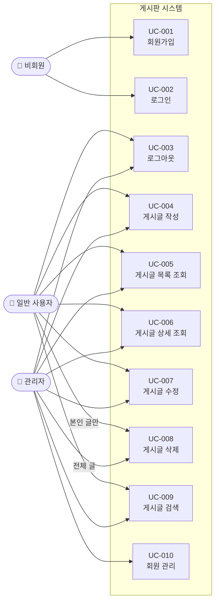

# 요구사항 정의서 — 게시판 프로젝트

## 1. 문서 개요

### 1.1 목적

본 문서는 SW프레임워크 수업 팀 프로젝트로 개발하는 **게시판 웹 애플리케이션**의 기능 및 비기능 요구사항을 정의한다. 개발팀 전원이 동일한 목표와 범위를 공유하고, 구현-테스트-평가의 기준으로 활용한다.

### 1.2 범위

| 항목 | 내용 |
|---|---|
| 프로젝트명 | 게시판 웹 애플리케이션 |
| 기술 스택 | Spring Boot 3.x, Java 21, MyBatis, Thymeleaf, MySQL 8.x, Gradle |
| 대상 사용자 | 일반 사용자(회원), 관리자 |
| 주요 기능 | 회원 관리, 게시판 CRUD, 검색, 페이징 |

### 1.3 참고 문서

| 문서명 | 위치 |
|---|---|
| ERD | `docs/ERD.md` |
| 화면설계서 | `docs/화면설계서.md` |
| 강의계획서 | `reference-pdf/강의계획서_이기하.pdf` |

### 1.4 용어 정의

| 용어 | 설명 |
|---|---|
| 사용자 | 회원가입을 완료하고 로그인한 이용자 |
| 관리자 | admin 권한을 가진 사용자 (테스트 계정: admin/1234) |
| 게시글 | 제목, 내용, 작성자 정보를 포함하는 게시판의 단위 데이터 |

---

## 2. 기능 요구사항

### 2.1 사용자 관리

| ID | 구분 | 요구사항명 | 상세 설명 | 우선순위 | 관련 화면 |
|---|---|---|---|---|---|
| FR-001 | 사용자 | 회원가입 | username, password, name을 입력하여 계정을 생성한다. username은 중복 불가. password는 4자 이상. BCrypt로 해시하여 저장한다. (현재 UserRepository 인메모리 구현, DB 미연동, BCrypt 암호화 적용) | 필수 | 회원가입 폼 |
| FR-002 | 사용자 | 로그인 | username + password로 인증하고, 인증 성공 시 HTTP 세션을 생성한다. | 필수 | 로그인 폼 |
| FR-003 | 사용자 | 로그아웃 | 현재 세션을 무효화(invalidate)하고, 로그인 페이지로 리다이렉트한다. | 필수 | - |
| FR-004 | 사용자 | 로그인 상태 유지 | 세션이 유효한 동안 페이지 이동 시 재로그인 없이 사용 가능하다. | 필수 | 전체 |
| FR-005 | 사용자 | 비로그인 접근 제한 | 로그인하지 않은 사용자가 게시판 기능에 접근하면 로그인 페이지로 리다이렉트한다. | 필수 | 전체 |

### 2.2 게시판

| ID | 구분 | 요구사항명 | 상세 설명 | 우선순위 | 관련 화면 |
|---|---|---|---|---|---|
| FR-006 | 게시판 | 글 작성 | 제목(필수, 최대 200자), 내용(필수)을 입력하고, 작성자는 로그인한 사용자의 username으로 자동 설정한다. | 필수 | 글 작성 폼 |
| FR-007 | 게시판 | 글 목록 조회 | 게시글을 최신순으로 페이징하여 표시한다. 한 페이지당 10건. 번호, 제목, 작성자, 작성일, 조회수를 표시한다. | 필수 | 목록 페이지 |
| FR-008 | 게시판 | 글 상세 조회 | 게시글의 제목, 내용, 작성자, 작성일, 수정일, 조회수를 표시한다. 조회 시 조회수가 1 증가한다. | 필수 | 상세 페이지 |
| FR-009 | 게시판 | 글 수정 | 작성자 본인만 수정 가능하다. 제목과 내용을 수정할 수 있으며, 수정일이 갱신된다. | 필수 | 글 수정 폼 |
| FR-010 | 게시판 | 글 삭제 | 작성자 본인 또는 관리자만 삭제 가능하다. 삭제 후 목록 페이지로 리다이렉트한다. | 필수 | 상세 페이지 |
| FR-011 | 게시판 | 페이징 | 전체 게시글 수 기반으로 페이지 번호를 계산하고, 이전/다음 네비게이션을 제공한다. 페이지당 10건, 페이지 블록당 5개 번호. | 필수 | 목록 페이지 |
| FR-012 | 게시판 | 제목 검색 | 제목에 검색어가 포함된 게시글을 조회한다. 검색 결과도 페이징을 적용한다. | 필수 | 목록 페이지 |
| FR-013 | 게시판 | 작성자 검색 | 작성자명에 검색어가 포함된 게시글을 조회한다. | 선택 | 목록 페이지 |
| FR-014 | 게시판 | 검색 조건 선택 | 검색 유형(제목/작성자/제목+내용)을 선택하여 검색할 수 있다. | 선택 | 목록 페이지 |
| FR-015 | 게시판 | 파일 첨부 업로드 | 게시글 작성/수정 시 파일 1개를 첨부할 수 있다. UUID 기반 저장명으로 서버에 저장한다. | 필수 | 글 작성/수정 폼 |
| FR-016 | 게시판 | 파일 다운로드 | 상세 페이지에서 첨부파일을 다운로드할 수 있다. Content-Disposition 헤더로 원본 파일명을 제공한다. | 필수 | 상세 페이지 |

### 2.3 관리자

| ID | 구분 | 요구사항명 | 상세 설명 | 우선순위 | 관련 화면 |
|---|---|---|---|---|---|
| FR-017 | 관리자 | 타인 글 삭제 | 관리자 권한을 가진 사용자는 모든 게시글을 삭제할 수 있다. | 필수 | 상세 페이지 |
| FR-018 | 관리자 | 회원 목록 조회 | 전체 회원의 username, name, 가입일을 목록으로 확인한다. | 선택 | 회원 목록 페이지 |
| FR-019 | 관리자 | 회원 삭제 | 특정 회원 계정을 삭제할 수 있다. 해당 회원의 게시글은 유지된다. | 선택 | 회원 목록 페이지 |

### 2.4 공통

| ID | 구분 | 요구사항명 | 상세 설명 | 우선순위 | 관련 화면 |
|---|---|---|---|---|---|
| FR-020 | 공통 | 네비게이션 바 | 모든 페이지 상단에 홈, 게시판, 로그인/로그아웃 링크를 포함하는 공통 네비게이션을 표시한다. | 필수 | 전체 |
| FR-021 | 공통 | 입력값 검증 | 필수 입력 항목이 비어있는 경우 클라이언트/서버 양쪽에서 검증하고 오류 메시지를 표시한다. | 필수 | 전체 폼 |
| FR-022 | 공통 | 오류 페이지 | 404(페이지 없음), 500(서버 오류) 발생 시 사용자 친화적 오류 페이지를 표시한다. | 선택 | 오류 페이지 |
| FR-023 | 공통 | 다국어 지원 | 한국어/영어 언어 전환을 지원한다. ?lang=ko\|en 파라미터로 언어를 변경하며, CookieLocaleResolver로 선택이 유지된다. | 선택 | 전체 |
| FR-024 | 공통 | IoC/DI 시연 | /greeting 엔드포인트에서 @Primary로 등록된 KoreanGreetingService가 주입됨을 시연한다. | 선택 | Greeting 페이지 |

---

## 3. 비기능 요구사항

| ID | 구분 | 요구사항명 | 상세 설명 |
|---|---|---|---|
| NFR-001 | 성능 | 응답 시간 | 주요 페이지(목록, 상세, 작성)는 3초 이내에 응답한다. |
| NFR-002 | 보안 | SQL 인젝션(Injection) 방지 | MyBatis `#{}` 바인딩을 사용하여 SQL 인젝션을 방지한다. `${}` 직접 삽입은 사용하지 않는다. |
| NFR-003 | 보안 | XSS 방지 | Thymeleaf `th:text`를 사용하여 HTML 이스케이프를 적용한다. 사용자 입력을 `th:utext`로 직접 출력하지 않는다. |
| NFR-004 | 보안 | 비밀번호 보안 | 비밀번호는 평문 저장을 금지하고, BCrypt 등의 해시 알고리즘으로 암호화하여 저장한다. |
| NFR-005 | 유지보수 | 계층 분리 | Controller-Service-Repository 3계층 구조를 준수한다. Controller에서 직접 SQL을 실행하지 않는다. |
| NFR-006 | 유지보수 | 코드 컨벤션 | Java 표준 명명 규칙을 따르고, 주요 메서드에 Javadoc 또는 한국어 주석을 포함한다. |
| NFR-007 | 배포 | 컨테이너화 | Dockerfile을 작성하여 `docker build`와 `docker run`으로 실행 가능해야 한다. |
| NFR-008 | 협업 | 버전 관리 | Git을 사용하며, 기능 단위로 커밋 메시지를 작성한다. main 브랜치에 직접 push하지 않고 PR을 사용한다. |
| NFR-009 | 보안 | 비밀번호 해시화 | BCrypt(spring-security-crypto)를 사용하여 비밀번호를 해시하여 저장한다. 평문 비밀번호를 DB에 저장하지 않는다. |
| NFR-010 | 유지보수 | 테스트 커버리지 | JaCoCo를 사용하여 전체 instruction 60% 이상, Service/Controller 라인 50% 이상을 유지한다. |

---

## 4. 유스케이스

### 4.1 액터 정의

| 액터 | 설명 |
|---|---|
| 일반 사용자 | 회원가입 후 로그인하여 게시판을 이용하는 사용자 |
| 관리자 | 시스템 관리 권한을 가진 사용자 (admin 계정) |
| 비회원 | 로그인하지 않은 방문자 (로그인/회원가입만 가능) |

### 4.2 유스케이스 목록

| UC ID | 유스케이스명 | 주요 액터 | 관련 FR |
|---|---|---|---|
| UC-001 | 회원가입 | 비회원 | FR-001 |
| UC-002 | 로그인 | 비회원 | FR-002 |
| UC-003 | 로그아웃 | 일반 사용자 | FR-003 |
| UC-004 | 게시글 작성 | 일반 사용자 | FR-006 |
| UC-005 | 게시글 목록 조회 | 일반 사용자 | FR-007, FR-011 |
| UC-006 | 게시글 상세 조회 | 일반 사용자 | FR-008 |
| UC-007 | 게시글 수정 | 일반 사용자 | FR-009 |
| UC-008 | 게시글 삭제 | 일반 사용자, 관리자 | FR-010, FR-017 |
| UC-009 | 게시글 검색 | 일반 사용자 | FR-012, FR-013, FR-014 |
| UC-010 | 회원 관리 | 관리자 | FR-018, FR-019 |

### 4.3 유스케이스 다이어그램

### 4.4 주요 유스케이스 상세

#### UC-004: 게시글 작성

| 항목 | 내용 |
|---|---|
| 유스케이스명 | 게시글 작성 |
| 액터 | 일반 사용자 |
| 사전 조건 | 사용자가 로그인 상태여야 한다 |
| 사후 조건 | 새 게시글이 DB에 저장되고, 목록에 표시된다 |

**기본 흐름:**

1. 사용자가 게시판 목록 페이지에서 [글쓰기] 버튼을 클릭한다.
2. 시스템이 글 작성 폼을 표시한다.
3. 사용자가 제목과 내용을 입력하고 [등록] 버튼을 클릭한다.
4. 시스템이 입력값을 검증한다.
5. 시스템이 게시글을 DB에 저장한다 (작성자는 세션의 username 자동 설정).
6. 시스템이 게시판 목록 페이지로 리다이렉트한다.

**대안 흐름:**

- 4a. 제목 또는 내용이 비어있는 경우: 오류 메시지를 표시하고 폼을 유지한다.
- 4b. 제목이 200자를 초과하는 경우: 오류 메시지를 표시한다.

#### UC-002: 로그인

| 항목 | 내용 |
|---|---|
| 유스케이스명 | 로그인 |
| 액터 | 비회원 |
| 사전 조건 | 회원가입이 완료된 계정이 존재해야 한다 |
| 사후 조건 | HTTP 세션이 생성되고, 게시판 목록으로 이동한다 |

**기본 흐름:**

1. 사용자가 로그인 페이지에 접속한다.
2. 시스템이 로그인 폼(username, password)을 표시한다.
3. 사용자가 username과 password를 입력하고 [로그인] 버튼을 클릭한다.
4. 시스템이 DB에서 username으로 사용자를 조회한다.
5. 시스템이 입력한 password와 저장된 해시값을 비교한다.
6. 인증 성공 시 세션에 사용자 정보를 저장한다.
7. 게시판 목록 페이지로 리다이렉트한다.

**대안 흐름:**

- 4a. username이 존재하지 않는 경우: "아이디 또는 비밀번호가 일치하지 않습니다" 메시지를 표시한다.
- 5a. password가 일치하지 않는 경우: 동일한 오류 메시지를 표시한다 (보안상 구분하지 않음).

---

## 5. 요구사항 추적 매트릭스

| 요구사항 ID | 유스케이스 | 화면 | DB 테이블 | API (URL) |
|---|---|---|---|---|
| FR-001 | UC-001 | 회원가입 폼 | users | UserRepository (인메모리) + BCrypt |
| FR-002 | UC-002 | 로그인 폼 | users | POST /login |
| FR-003 | UC-003 | - | - | POST /logout |
| FR-006 | UC-004 | 글 작성 폼 | board | POST /board/create |
| FR-007 | UC-005 | 목록 페이지 | board | GET /board/list |
| FR-008 | UC-006 | 상세 페이지 | board | GET /board/detail/{id} |
| FR-009 | UC-007 | 글 수정 폼 | board | POST /board/edit/{id} |
| FR-010 | UC-008 | 상세 페이지 | board | POST /board/delete/{id} |
| FR-012 | UC-009 | 목록 페이지 | board | GET /board/list?keyword=xxx |
| FR-015 | - | 글 작성/수정 폼 | board | POST /board/create, POST /board/edit/{id} |
| FR-016 | - | 상세 페이지 | board | GET /board/download/{id} |
| FR-023 | - | 전체 | - | GET /**?lang=ko\|en |
| FR-024 | - | Greeting 페이지 | - | GET /greeting |
