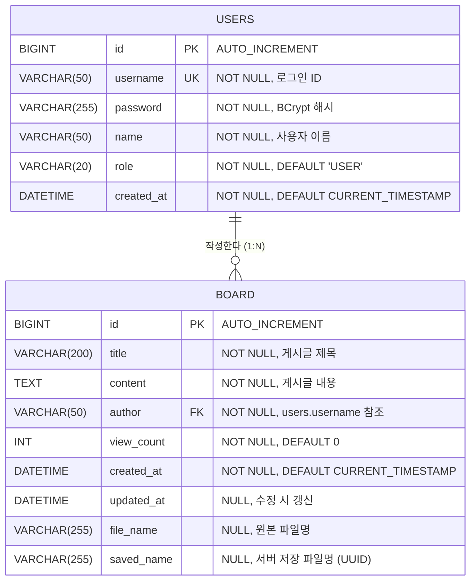

# ERD 및 테이블 정의서 — 게시판 프로젝트

> **Entity-Relationship Diagram & DDL**
> SW 프레임워크 · **W09 과제** · 제출 기한 **W10 수업 시작 전**
> 한국공학대학교 IT경영전공 · 2026학년도 1학기

---

## 1. 프로젝트 기본 정보

| 항목 | 내용 |
|---|---|
| 프로젝트명 | Spring Boot 게시판 (sw-framework-demo) |
| 팀명 / 팀장 | 예시팀 / 홍길동 |
| DBMS | MySQL 8.x |
| 문자셋 / Collation | utf8mb4 / utf8mb4_general_ci |
| 스토리지 엔진 | InnoDB |
| 테이블 수 | 2개 (users · board) |

본 문서는 **W08 요구사항 정의서**의 DB 테이블 초안(users · board)을 ERD와 DDL로 확정한 산출물이다.

---

## 2. ERD 다이어그램



---

## 3. 테이블 상세 설계

### 3.1 users (사용자)

| 컬럼명 | 타입 | 제약조건 | 기본값 | 설명 |
|---|---|---|---|---|
| id | BIGINT | PK, AUTO_INCREMENT | - | 사용자 고유 식별자 |
| username | VARCHAR(50) | NOT NULL, UNIQUE | - | 로그인 ID (중복 불가) |
| password | VARCHAR(255) | NOT NULL | - | BCrypt로 해시된 비밀번호 |
| name | VARCHAR(50) | NOT NULL | - | 사용자 표시 이름 |
| role | VARCHAR(20) | NOT NULL | 'USER' | 권한 (USER / ADMIN) |
| created_at | DATETIME | NOT NULL | CURRENT_TIMESTAMP | 계정 생성 일시 |

**인덱스:**

| 인덱스명 | 컬럼 | 유형 | 설명 |
|---|---|---|---|
| PRIMARY | id | PK | 기본키 |
| uk_users_username | username | UNIQUE | 로그인 ID 유일성 보장 |

### 3.2 board (게시판)

| 컬럼명 | 타입 | 제약조건 | 기본값 | 설명 |
|---|---|---|---|---|
| id | BIGINT | PK, AUTO_INCREMENT | - | 게시글 고유 식별자 |
| title | VARCHAR(200) | NOT NULL | - | 게시글 제목 (최대 200자) |
| content | TEXT | NOT NULL | - | 게시글 본문 |
| author | VARCHAR(50) | NOT NULL, FK | - | 작성자 (users.username 참조) |
| view_count | INT | NOT NULL | 0 | 조회수 |
| created_at | DATETIME | NOT NULL | CURRENT_TIMESTAMP | 작성 일시 |
| updated_at | DATETIME | NULL | NULL | 마지막 수정 일시 |
| file_name | VARCHAR(255) | NULL | NULL | 첨부파일 원본 파일명 |
| saved_name | VARCHAR(255) | NULL | NULL | 서버 저장 파일명 (UUID 형식) |

**인덱스:**

| 인덱스명 | 컬럼 | 유형 | 설명 |
|---|---|---|---|
| PRIMARY | id | PK | 기본키 |
| fk_board_author | author | FK | users.username 참조 |
| idx_board_created_at | created_at | INDEX | 최신순 정렬 성능 향상 |
| idx_board_title | title | INDEX | 제목 검색 성능 향상 |

---

## 4. 테이블 관계

| 부모 테이블 | 자식 테이블 | 관계 | FK 컬럼 | 참조 컬럼 | 설명 |
|---|---|---|---|---|---|
| users | board | 1:N | board.author | users.username | 한 사용자가 여러 게시글을 작성할 수 있다 |

**참조 무결성 규칙:**

- `ON UPDATE CASCADE`: 사용자의 username이 변경되면 게시글의 author도 함께 변경된다.
- `ON DELETE RESTRICT`: 게시글이 존재하는 사용자는 삭제할 수 없다. (관리자가 게시글 먼저 삭제 후 회원 삭제)

---

## 5. 초기 데이터

### 5.1 테스트 계정

| username | password (원본) | name | role | 용도 |
|---|---|---|---|---|
| admin | 1234 | 관리자 | ADMIN | 관리자 테스트 계정 |
| guest | 1234 | 게스트 | USER | 일반 사용자 테스트 계정 |

> password는 BCrypt로 해시하여 저장한다. 위 원본 값은 개발/테스트 용도이다.

---

## 6. SQL DDL 스크립트

```sql
-- ============================================
-- 게시판 프로젝트 DDL 스크립트
-- DBMS: MySQL 8.x
-- 문자셋: utf8mb4
-- ============================================

-- 데이터베이스 생성
CREATE DATABASE IF NOT EXISTS swframework
    DEFAULT CHARACTER SET utf8mb4
    DEFAULT COLLATE utf8mb4_general_ci;

USE swframework;

-- ============================================
-- 1. users 테이블 (사용자)
-- ============================================
CREATE TABLE users (
    id         BIGINT       NOT NULL AUTO_INCREMENT COMMENT '사용자 고유 식별자',
    username   VARCHAR(50)  NOT NULL COMMENT '로그인 ID',
    password   VARCHAR(255) NOT NULL COMMENT 'BCrypt 해시 비밀번호',
    name       VARCHAR(50)  NOT NULL COMMENT '사용자 이름',
    role       VARCHAR(20)  NOT NULL DEFAULT 'USER' COMMENT '권한 (USER/ADMIN)',
    created_at DATETIME     NOT NULL DEFAULT CURRENT_TIMESTAMP COMMENT '계정 생성일시',

    PRIMARY KEY (id),
    UNIQUE KEY uk_users_username (username)
) ENGINE=InnoDB DEFAULT CHARSET=utf8mb4 COLLATE=utf8mb4_general_ci
  COMMENT='사용자 정보';

-- ============================================
-- 2. board 테이블 (게시판)
-- ============================================
CREATE TABLE board (
    id         BIGINT       NOT NULL AUTO_INCREMENT COMMENT '게시글 고유 식별자',
    title      VARCHAR(200) NOT NULL COMMENT '게시글 제목',
    content    TEXT         NOT NULL COMMENT '게시글 내용',
    author     VARCHAR(50)  NOT NULL COMMENT '작성자 (users.username)',
    view_count INT          NOT NULL DEFAULT 0 COMMENT '조회수',
    created_at DATETIME     NOT NULL DEFAULT CURRENT_TIMESTAMP COMMENT '작성일시',
    updated_at DATETIME     NULL DEFAULT NULL ON UPDATE CURRENT_TIMESTAMP COMMENT '수정일시',
    file_name  VARCHAR(255) NULL COMMENT '첨부파일 원본 파일명',
    saved_name VARCHAR(255) NULL COMMENT '서버 저장 파일명 (UUID)',

    PRIMARY KEY (id),
    INDEX idx_board_created_at (created_at DESC),
    INDEX idx_board_title (title),
    CONSTRAINT fk_board_author
        FOREIGN KEY (author) REFERENCES users (username)
        ON UPDATE CASCADE
        ON DELETE RESTRICT
) ENGINE=InnoDB DEFAULT CHARSET=utf8mb4 COLLATE=utf8mb4_general_ci
  COMMENT='게시판';

-- ============================================
-- 3. 초기 데이터 (테스트 계정)
-- ============================================
-- 비밀번호 '1234'의 BCrypt 해시값
-- BCrypt는 매번 다른 해시를 생성하므로 애플리케이션에서 삽입하는 것을 권장한다.
-- 아래는 예시 해시값이다.
INSERT INTO users (username, password, name, role) VALUES
    ('admin', '$2a$10$N9qo8uLOickgx2ZMRZoMyeIjZAgcfl7p92ldGxad68LJZdL17lhWy', '관리자', 'ADMIN'),
    ('guest', '$2a$10$N9qo8uLOickgx2ZMRZoMyeIjZAgcfl7p92ldGxad68LJZdL17lhWy', '게스트', 'USER');

-- ============================================
-- 4. 테스트용 게시글 (선택사항)
-- ============================================
INSERT INTO board (title, content, author) VALUES
    ('첫 번째 게시글입니다', '게시판이 정상적으로 동작하는지 확인하는 테스트 글입니다.', 'admin'),
    ('두 번째 게시글', '안녕하세요. 게스트 계정으로 작성한 글입니다.', 'guest'),
    ('Spring Boot 학습 후기', 'Spring Boot 3.x를 처음 사용해봤는데 편리합니다.', 'guest');
```

---

## 7. MyBatis 매핑 참고

### 7.1 users 매핑 (Java 클래스)

```java
// src/main/java/kr/ac/tukorea/swframework/domain/User.java
public class User {
    private Long id;
    private String username;
    private String password;
    private String name;
    private String role;
    private LocalDateTime createdAt;
    // getter/setter 생략
}
```

### 7.2 board 매핑 (Java 클래스)

```java
// src/main/java/kr/ac/tukorea/swframework/dto/BoardDTO.java
public class BoardDTO {
    private Long id;
    private String title;
    private String content;
    private String author;
    private int viewCount;
    private LocalDateTime createdAt;
    private LocalDateTime updatedAt;
    private String fileName;   // 첨부파일 원본 파일명
    private String savedName;  // 서버 저장 파일명 (UUID)
    // getter/setter 생략
}
```

---

## ✅ 제출 전 체크리스트

- [x] Mermaid ERD 코드 작성 (GitHub에서 렌더링 확인)
- [x] 모든 테이블에 PK 정의
- [x] FK 관계 표시 및 참조 무결성 확인 (`ON UPDATE CASCADE` / `ON DELETE RESTRICT`)
- [x] NOT NULL · UNIQUE 제약 조건 명시
- [x] CREATE TABLE DDL 작성 (MySQL 기준)
- [x] W08 요구사항 정의서의 테이블 초안과 일치
- [x] DDL 실행 테스트 완료 (MySQL에서 오류 없이 생성)
- [x] GitHub 저장소 `docs/W09_ERD.md` + `sql/schema.sql`로 업로드
