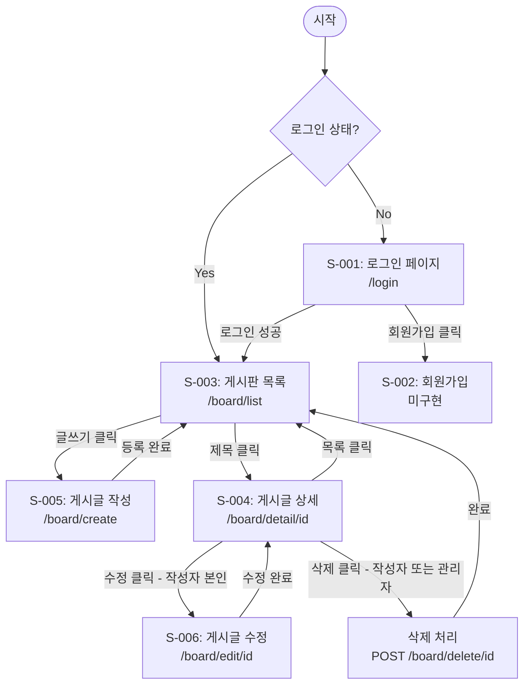

# 화면설계서 — 게시판 프로젝트

## 1. 화면 목록

| 번호 | 화면명 | URL | HTTP Method | 접근 권한 | 관련 FR |
|---|---|---|---|---|---|
| S-001 | 로그인 페이지 | `/login` | GET, POST | 전체 | FR-002 |
| S-002 | 회원가입 페이지 | 미구현 (하드코딩 인증) | - | - | FR-001 |
| S-003 | 게시판 목록 페이지 | `/board/list` | GET | 로그인 사용자 | FR-007, FR-011, FR-012 |
| S-004 | 게시글 상세 페이지 | `/board/detail/{id}` | GET | 로그인 사용자 | FR-008 |
| S-005 | 게시글 작성 폼 | `/board/create` | GET, POST | 로그인 사용자 | FR-006 |
| S-006 | 게시글 수정 폼 | `/board/edit/{id}` | GET, POST | 작성자 본인 | FR-009 |

---

## 2. 공통 레이아웃

### 2.1 네비게이션 바 (전체 페이지 공통)

```
┌──────────────────────────────────────────────────────────────────┐
│  [게시판]          [홈]    [게시판]    [로그인] 또는 [OOO님 ▾]          │
│                                                [로그아웃]          │
└──────────────────────────────────────────────────────────────────┘
```

**동작 규칙:**

- 비로그인 상태: `[로그인]` 링크 표시
- 로그인 상태: `[OOO님]` + `[로그아웃]` 링크 표시
- `[홈]`: `/board/list`로 이동
- `[게시판]`: `/board/list`로 이동

---

## 3. 화면 상세 설계

### S-001: 로그인 페이지

**URL:** `GET /login` (폼 표시) / `POST /login` (로그인 처리)

```
┌──────────────────────────────────────────────────────────────────┐
│  [네비게이션 바]                                                    │
├──────────────────────────────────────────────────────────────────┤
│                                                                  │
│                        로그인                                      │
│                                                                  │
│              ┌─────────────────────────┐                         │
│  아이디        │                         │                         │
│              └─────────────────────────┘                         │
│              ┌─────────────────────────┐                         │
│  비밀번호      │ ●●●●●●                  │                         │
│              └─────────────────────────┘                         │
│                                                                  │
│              ┌─────────────────────────┐                         │
│              │        로그인             │                         │
│              └─────────────────────────┘                         │
│                                                                  │
│              아직 계정이 없으신가요? [회원가입]                          │
│                                                                  │
│              ⚠ 아이디 또는 비밀번호가 일치하지 않습니다.                   │
│              (로그인 실패 시에만 표시)                                 │
│                                                                  │
└──────────────────────────────────────────────────────────────────┘
```

**입력 데이터:**

| 필드명 | HTML name | 타입 | 필수 | 검증 규칙 |
|---|---|---|---|---|
| 아이디 | loginId | text | Y | 빈 값 불가 |
| 비밀번호 | password | password | Y | 빈 값 불가 |

**이벤트:**

| 이벤트 | 동작 |
|---|---|
| [로그인] 버튼 클릭 | `POST /login`으로 폼 제출. 성공 시 `/board/list`로 리다이렉트, 실패 시 오류 메시지 표시 |
| [회원가입] 링크 클릭 | 미구현 (하드코딩 계정: admin/1234, guest/1234만 사용 가능) |

---

### S-002: 회원가입 페이지 (미구현)

현재 버전에서는 회원가입 기능이 구현되어 있지 않다.
로그인은 하드코딩된 테스트 계정(admin/1234, guest/1234)으로만 가능하다.

---

### S-003: 게시판 목록 페이지

**URL:** `GET /board/list?page=1&searchType=title&keyword=검색어`

```
┌──────────────────────────────────────────────────────────────────┐
│  [네비게이션 바]                                                    │
├──────────────────────────────────────────────────────────────────┤
│                                                                  │
│  게시판                                        [글쓰기]             │
│                                                                  │
│  ┌────┬──────────────────────┬────────┬───────────┬───────┐      │
│  │ No │ 제목                  │ 작성자   │ 작성일     │ 조회   │       │
│  ├────┼──────────────────────┼────────┼───────────┼───────┤      │
│  │ 50 │ Spring Boot 학습 후기  │ guest  │ 2026-03-14│   12  │      │
│  ├────┼──────────────────────┼────────┼───────────┼───────┤      │
│  │ 49 │ 두 번째 게시글          │ guest  │ 2026-03-13│    8  │      │
│  ├────┼──────────────────────┼────────┼───────────┼───────┤      │
│  │ 48 │ 첫 번째 게시글입니다      │ admin  │ 2026-03-12│   25  │      │
│  ├────┼──────────────────────┼────────┼───────────┼───────┤      │
│  │ .. │ ...                  │ ...    │ ...       │  ...  │      │
│  ├────┼──────────────────────┼────────┼───────────┼───────┤      │
│  │ 41 │ 게시글 제목             │ user01 │ 2026-03-05│    3  │      │
│  └────┴──────────────────────┴────────┴───────────┴───────┘      │
│                                                                  │
│              [<] [1] [2] [3] [4] [5] [>]                         │
│                                                                  │
│  ┌──────────┐ ┌──────────────────────┐ ┌──────┐                  │
│  │ 제목  ▾   │ │ 검색어 입력             │ │ 검색  │                  │
│  └──────────┘ └──────────────────────┘ └──────┘                  │
│                                                                  │
└──────────────────────────────────────────────────────────────────┘
```

**출력 데이터:**

| 컬럼 | 설명 | 데이터 소스 |
|---|---|---|
| No | 게시글 순번 (전체 건수 기준 역순) | 계산: totalCount - ((page-1) * pageSize) - index |
| 제목 | 게시글 제목 (클릭 시 상세 페이지로 이동) | board.title |
| 작성자 | 작성자 username | board.author |
| 작성일 | 작성 날짜 (yyyy-MM-dd 형식) | board.created_at |
| 조회 | 조회수 | board.view_count |

**페이징 규칙:**

| 항목 | 값 |
|---|---|
| 한 페이지당 게시글 수 | 10건 |
| 페이지 블록 크기 | 5개 (예: 1~5, 6~10) |
| `[<]` 버튼 | 이전 블록의 마지막 페이지로 이동 (1페이지 미만이면 비활성) |
| `[>]` 버튼 | 다음 블록의 첫 페이지로 이동 (마지막 블록이면 비활성) |

**이벤트:**

| 이벤트 | 동작 |
|---|---|
| 제목 클릭 | `/board/detail/{id}`로 이동 |
| [글쓰기] 버튼 클릭 | `/board/create`로 이동 |
| 페이지 번호 클릭 | `/board/list?page={n}`으로 이동 (검색 중이면 검색 조건 유지) |
| [검색] 버튼 클릭 | `/board/list?page=1&searchType={type}&keyword={keyword}`로 이동 |

**검색 옵션:**

| 검색 유형 (searchType) | 설명 |
|---|---|
| title | 제목에서 검색 |
| author | 작성자에서 검색 |
| titleContent | 제목 + 내용에서 검색 |

---

### S-004: 게시글 상세 페이지

**URL:** `GET /board/detail/{id}`

```
┌──────────────────────────────────────────────────────────────────┐
│  [네비게이션 바]                                                    │
├──────────────────────────────────────────────────────────────────┤
│                                                                  │
│  Spring Boot 학습 후기                                             │
│  ─────────────────────────────────────────────────────────       │
│                                                                  │
│  작성자: guest    작성일: 2026-03-14    조회수: 12                    │
│                  수정일: 2026-03-15                                │
│                                                                  │
│  ─────────────────────────────────────────────────────────       │
│                                                                  │
│  Spring Boot 3.x를 처음 사용해봤는데 편리합니다.                         │
│  특히 자동 설정 기능이 인상적이었고, Thymeleaf와의                         │
│  연동도 매우 쉬웠습니다.                                               │
│                                                                  │
│  ─────────────────────────────────────────────────────────       │
│                                                                  │
│  [목록]    [수정]    [삭제]                                         │
│                                                                  │
│  (수정/삭제: 작성자 본인 또는 관리자에게만 표시)                            │
│                                                                  │
└──────────────────────────────────────────────────────────────────┘
```

**출력 데이터:**

| 항목 | 데이터 소스 |
|---|---|
| 제목 | board.title |
| 작성자 | board.author |
| 작성일 | board.created_at (yyyy-MM-dd HH:mm) |
| 수정일 | board.updated_at (수정된 경우에만 표시) |
| 조회수 | board.view_count |
| 내용 | board.content |

**버튼 표시 규칙:**

| 버튼 | 표시 조건 | 동작 |
|---|---|---|
| [목록] | 항상 | `/board/list`로 이동 (이전 페이지/검색 조건 유지) |
| [수정] | 로그인 사용자 == 작성자 | `/board/edit/{id}`로 이동 |
| [삭제] | 로그인 사용자 == 작성자 OR 관리자 | 확인 대화상자 후 `POST /board/delete/{id}` 실행 |

**이벤트:**

| 이벤트 | 동작 |
|---|---|
| 페이지 진입 | 조회수 +1 (board.view_count UPDATE) |
| [삭제] 클릭 | JavaScript `confirm("정말 삭제하시겠습니까?")` → 확인 시 삭제 후 목록으로 리다이렉트 |

---

### S-005: 게시글 작성 폼

**URL:** `GET /board/create` (폼 표시) / `POST /board/create` (저장 처리)

```
┌──────────────────────────────────────────────────────────────────┐
│  [네비게이션 바]                                                    │
├──────────────────────────────────────────────────────────────────┤
│                                                                  │
│  게시글 작성                                                        │
│                                                                  │
│  ┌──────────────────────────────────────────────────────────┐    │
│  │ 제목                                                      │    │
│  └──────────────────────────────────────────────────────────┘    │
│                                                                  │
│  ┌──────────────────────────────────────────────────────────┐    │
│  │                                                          │    │
│  │ 내용                                                      │    │
│  │                                                          │    │
│  │                                                          │    │
│  │                                                          │    │
│  │                                                          │    │
│  └──────────────────────────────────────────────────────────┘    │
│                                                                  │
│  [취소]                                        [등록]              │
│                                                                  │
└──────────────────────────────────────────────────────────────────┘
```

**입력 데이터:**

| 필드명 | HTML name | 타입 | 필수 | 검증 규칙 |
|---|---|---|---|---|
| 제목 | title | text | Y | 빈 값 불가, 최대 200자 |
| 내용 | content | textarea | Y | 빈 값 불가 |

**자동 설정 데이터:**

| 항목 | 값 | 설명 |
|---|---|---|
| author | 세션의 username | 서버에서 자동 설정 (사용자 입력 불가) |
| created_at | CURRENT_TIMESTAMP | DB에서 자동 설정 |

**이벤트:**

| 이벤트 | 동작 |
|---|---|
| [등록] 버튼 클릭 | 클라이언트 검증 후 `POST /board/create`로 제출. 성공 시 `/board/list`로 리다이렉트 |
| [취소] 버튼 클릭 | `/board/list`로 이동 (입력 내용이 있으면 `confirm` 대화상자 표시) |

---

### S-006: 게시글 수정 폼

**URL:** `GET /board/edit/{id}` (폼 표시) / `POST /board/edit/{id}` (수정 처리)

```
┌──────────────────────────────────────────────────────────────────┐
│  [네비게이션 바]                                                    │
├──────────────────────────────────────────────────────────────────┤
│                                                                  │
│  게시글 수정                                                        │
│                                                                  │
│  ┌──────────────────────────────────────────────────────────┐    │
│  │ Spring Boot 학습 후기                (기존 제목 표시)          │    │
│  └──────────────────────────────────────────────────────────┘    │
│                                                                  │
│  ┌──────────────────────────────────────────────────────────┐    │
│  │ Spring Boot 3.x를 처음 사용해봤는데 편리합니다.                  │    │
│  │ 특히 자동 설정 기능이 인상적이었고...                            │    │
│  │                          (기존 내용 표시)                   │    │
│  │                                                          │    │
│  │                                                          │    │
│  │                                                          │    │
│  └──────────────────────────────────────────────────────────┘    │
│                                                                  │
│  [취소]                                        [수정]              │
│                                                                  │
└──────────────────────────────────────────────────────────────────┘
```

**입력 데이터:**

| 필드명 | HTML name | 타입 | 필수 | 검증 규칙 | 초기값 |
|---|---|---|---|---|---|
| 제목 | title | text | Y | 빈 값 불가, 최대 200자 | 기존 게시글 제목 |
| 내용 | content | textarea | Y | 빈 값 불가 | 기존 게시글 내용 |

**접근 제어:**

- 로그인한 사용자의 username과 게시글의 author가 일치하는 경우에만 접근 가능
- 불일치 시 목록 페이지로 리다이렉트하고 "수정 권한이 없습니다" 메시지 표시

**이벤트:**

| 이벤트 | 동작 |
|---|---|
| [수정] 버튼 클릭 | `POST /board/edit/{id}`로 제출. 성공 시 `/board/detail/{id}` 상세 페이지로 리다이렉트 |
| [취소] 버튼 클릭 | `/board/detail/{id}` 상세 페이지로 이동 |

---

## 4. 화면 흐름도



---

## 5. HTTP API 요약

| 화면 | Method | URL | 요청 데이터 | 응답 | 비고 |
|---|---|---|---|---|---|
| 로그인 폼 | GET | `/login` | - | HTML | |
| 로그인 처리 | POST | `/login` | loginId, password | Redirect | 성공: `/board/list`, 실패: `/login` |
| 회원가입 폼 | - | 미구현 | - | - | 하드코딩 계정만 사용 가능 (admin/1234, guest/1234) |
| 로그아웃 | POST | `/logout` | - | Redirect | → `/login` |
| 게시판 목록 | GET | `/board/list` | page, searchType, keyword (쿼리스트링) | HTML | |
| 글 상세 | GET | `/board/detail/{id}` | - | HTML | |
| 글 작성 폼 | GET | `/board/create` | - | HTML | |
| 글 작성 처리 | POST | `/board/create` | title, content | Redirect | → `/board/list` |
| 글 수정 폼 | GET | `/board/edit/{id}` | - | HTML | 작성자만 접근 |
| 글 수정 처리 | POST | `/board/edit/{id}` | title, content | Redirect | → `/board/detail/{id}` |
| 글 삭제 처리 | POST | `/board/delete/{id}` | - | Redirect | → `/board/list` |
| 파일 다운로드 | GET | `/board/download/{savedName}` | - | File | |
