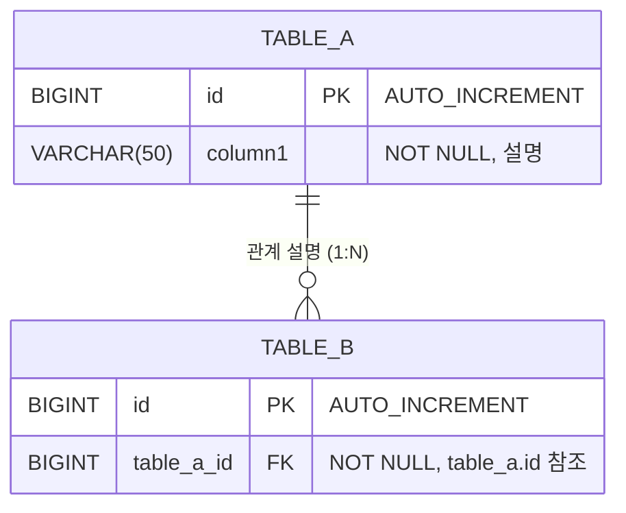

# ERD (개체-관계 다이어그램) — [프로젝트명]

## 1. 개요

| 항목 | 내용 |
|---|---|
| DBMS | MySQL 8.x |
| 문자셋 | utf8mb4 |
| Collation | utf8mb4_general_ci |
| 스토리지 엔진 | InnoDB |

---

## 2. ERD 다이어그램

> Mermaid erDiagram 형식으로 테이블 간 관계를 표현한다.



> **작성 요령:**
> - PK, FK, UK 등 제약조건을 다이어그램에 표기한다.
> - 관계선 기호: `||--o{` (1:N), `||--||` (1:1), `}o--o{` (M:N)

---

## 3. 테이블 상세 설계

### 3.1 [테이블명 1] ([한글 설명])

| 컬럼명 | 타입 | 제약조건 | 기본값 | 설명 |
|---|---|---|---|---|
| id | BIGINT | PK, AUTO_INCREMENT | - | 고유 식별자 |
| | | | | |

**인덱스:**

| 인덱스명 | 컬럼 | 유형 | 설명 |
|---|---|---|---|
| PRIMARY | id | PK | 기본키 |
| | | | |

### 3.2 [테이블명 2] ([한글 설명])

| 컬럼명 | 타입 | 제약조건 | 기본값 | 설명 |
|---|---|---|---|---|
| id | BIGINT | PK, AUTO_INCREMENT | - | 고유 식별자 |
| | | | | |

**인덱스:**

| 인덱스명 | 컬럼 | 유형 | 설명 |
|---|---|---|---|
| PRIMARY | id | PK | 기본키 |
| | | | |

---

## 4. 테이블 관계

| 부모 테이블 | 자식 테이블 | 관계 | FK 컬럼 | 참조 컬럼 | 설명 |
|---|---|---|---|---|---|
| | | 1:N | | | |

**참조 무결성 규칙:**

- `ON UPDATE CASCADE / RESTRICT`: (규칙 설명)
- `ON DELETE CASCADE / RESTRICT`: (규칙 설명)

---

## 5. 초기 데이터

### 5.1 테스트 계정

| 계정 | 비밀번호 (원본) | 역할 | 용도 |
|---|---|---|---|
| admin | 1234 | 관리자 | 관리자 테스트 |
| guest | 1234 | 일반 사용자 | 일반 사용자 테스트 |

---

## 6. SQL DDL 스크립트

```sql
-- ============================================
-- [프로젝트명] DDL 스크립트
-- DBMS: MySQL 8.x
-- ============================================

-- 데이터베이스 생성
CREATE DATABASE IF NOT EXISTS [db_name]
    DEFAULT CHARACTER SET utf8mb4
    DEFAULT COLLATE utf8mb4_general_ci;

USE [db_name];

-- ============================================
-- 1. [테이블명] 테이블
-- ============================================
CREATE TABLE [테이블명] (
    id         BIGINT       NOT NULL AUTO_INCREMENT COMMENT '고유 식별자',
    -- 컬럼 추가

    PRIMARY KEY (id)
) ENGINE=InnoDB DEFAULT CHARSET=utf8mb4 COLLATE=utf8mb4_general_ci
  COMMENT='테이블 설명';

-- ============================================
-- 초기 데이터
-- ============================================
-- INSERT INTO ...
```

---

## 7. MyBatis 매핑 참고

> 각 테이블에 대응하는 Java 도메인 클래스를 정의한다.

```java
// src/main/java/kr/ac/tukorea/swframework/domain/[클래스명].java
public class [클래스명] {
    private Long id;
    // 필드 추가
    // getter/setter 생략
}
```
