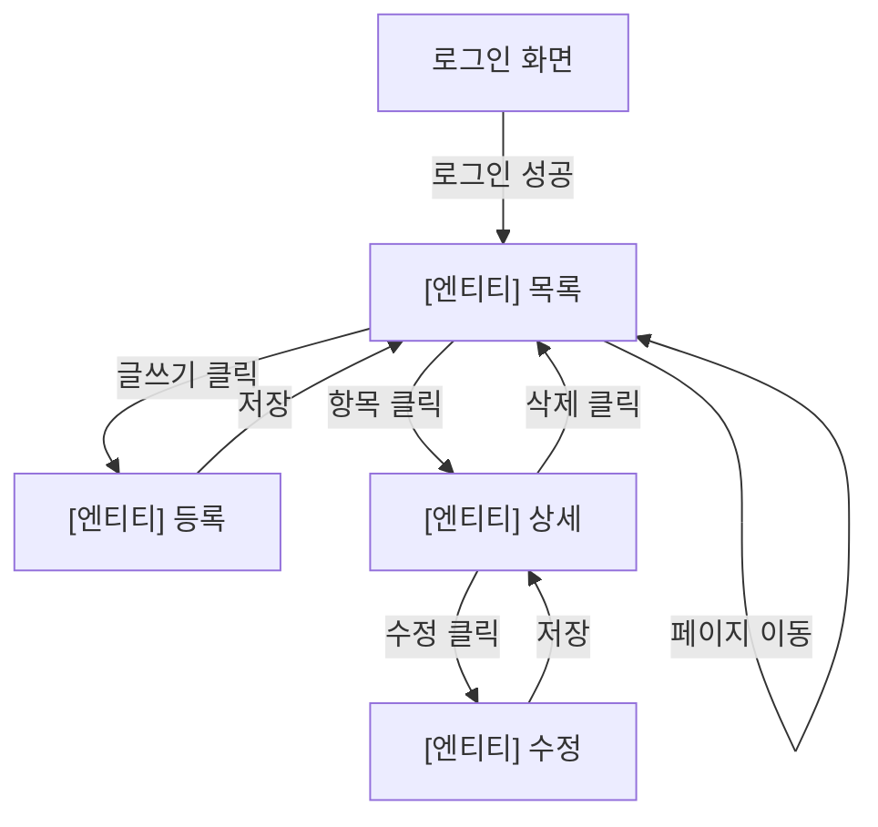
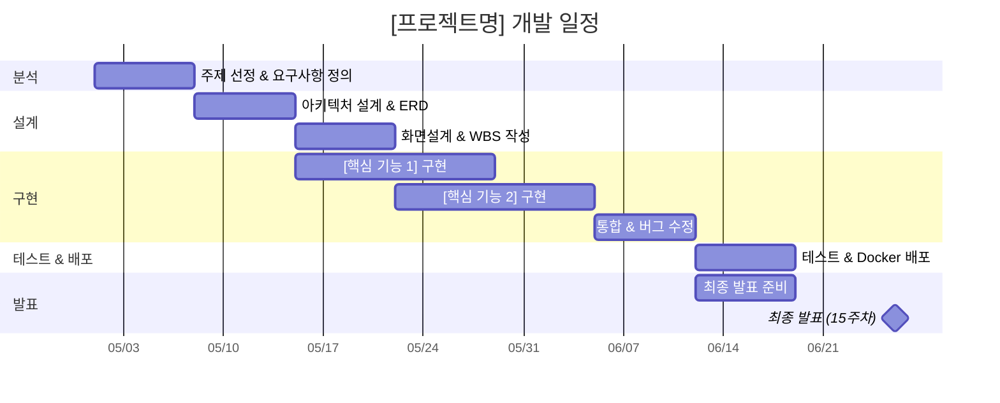
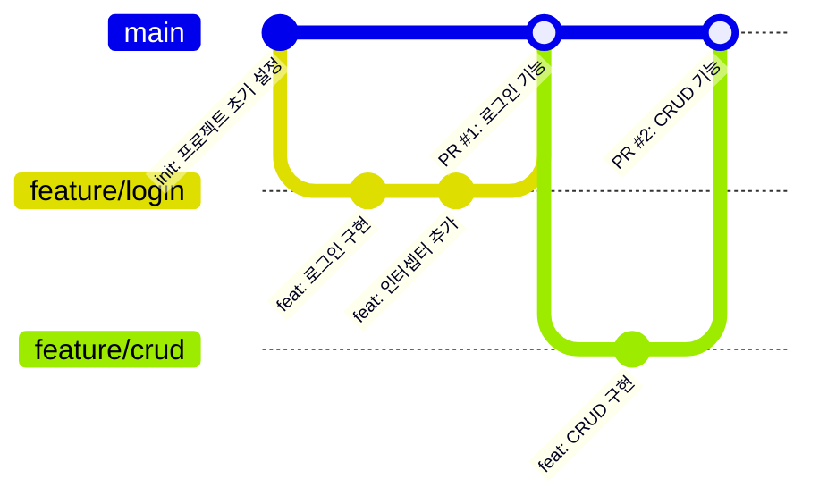

# 제안요청서 (RFP)

## [프로젝트명] 구축

<!-- ============================================
  RFP 템플릿 사용 안내
  ============================================
  - [ ] 대괄호로 감싼 [플레이스홀더]를 팀 프로젝트에 맞게 수정하세요.
  - [ ] <!-- 주석 --> 부분은 작성 가이드입니다. 작성 후 삭제해도 됩니다.
  - [ ] 필수 섹션은 반드시 포함하고, 선택 섹션은 필요에 따라 추가합니다.
  - [ ] 완성된 제안서는 A4 5~10페이지 분량을 목표로 합니다.
  ============================================ -->

| 항목 | 내용 |
|---|---|
| **문서 버전** | v1.0 |
| **작성일** | [YYYY-MM-DD] |
| **팀명** | [팀명] |
| **팀원** | [팀원1 (역할)], [팀원2 (역할)], [팀원3 (역할)], [팀원4 (역할)] |
| **과목** | SW프레임워크 (2026-1학기) |
| **소속** | 한국공학대학교 경영학부 IT경영전공 |

---

## 1. 사업 개요

<!-- 작성 가이드: 프로젝트의 기본 정보를 한눈에 파악할 수 있도록 표로 정리합니다. -->

| 항목 | 내용 |
|---|---|
| **사업명** | [프로젝트명] 구축 |
| **발주기관** | 한국공학대학교 IT경영전공 SW프레임워크 교과목 |
| **사업기간** | 2026년 4월 ~ 6월 (약 10주, 8주차~15주차) |
| **예산** | 교육용 (무상) |
| **수행주체** | [팀명] ([인원수]인) |
| **최종 납품** | 15주차 최종 발표 시 시연 및 GitHub 저장소 제출 |

---

## 2. 사업 배경 및 목적

### 2.1 배경

<!-- 작성 가이드:
  "왜 이 시스템이 필요한가?"를 설명합니다.
  - 현재 어떤 문제가 있는지 (불편한 점, 비효율)
  - 기존에 어떤 방식으로 해결하고 있었는지
  - 기존 방식의 한계점은 무엇인지
  예시: "현재 동아리 일정 관리를 카카오톡 단톡방에서 하고 있어 일정 누락이 빈번하다..."
-->

[현재 상황과 문제점을 2~3문단으로 서술]

- [문제점 1: 구체적인 불편함 또는 비효율]
- [문제점 2: 기존 방식의 한계]
- [문제점 3: 개선이 필요한 이유]

### 2.2 목적

<!-- 작성 가이드:
  이 프로젝트를 통해 달성하려는 목표를 3~4개로 정리합니다.
  목표는 "~한다" 형태로 명확하게 작성합니다.
-->

1. **[목표 1]**: [구체적 설명]
2. **[목표 2]**: [구체적 설명]
3. **[목표 3]**: [구체적 설명]

### 2.3 기대 효과

<!-- 작성 가이드:
  프로젝트 완료 후 어떤 긍정적 변화가 예상되는지 작성합니다.
  사용자 관점과 개발팀 관점 모두 포함하면 좋습니다.
-->

- [기대 효과 1: 사용자 편의성 측면]
- [기대 효과 2: 업무 효율성 측면]
- [기대 효과 3: 학습/역량 향상 측면]

---

## 3. 사업 범위

### 3.1 기능 요구사항

<!-- 작성 가이드:
  시스템이 수행해야 할 기능을 도메인별로 분류하여 나열합니다.
  - ID는 "F-001"부터 순번을 매깁니다.
  - 우선순위는 반드시 "필수" 또는 "선택"으로 구분합니다.
  - 필수 기능: CRUD 2개 이상 + 로그인 + 검색 + 페이징은 반드시 포함
  - 한 기능을 너무 크게 잡지 말고, 작은 단위로 쪼개어 작성합니다.
-->

#### 3.1.1 사용자 관리

| ID | 기능명 | 설명 | 우선순위 |
|---|---|---|---|
| F-001 | 로그인 | 아이디·비밀번호로 세션 기반 로그인 | **필수** |
| F-002 | 로그아웃 | 세션 무효화 후 로그인 페이지로 이동 | **필수** |
| F-003 | 접근 제어 | 비로그인 사용자의 주요 기능 접근 차단 (인터셉터 활용) | **필수** |
| F-004 | [추가 기능] | [설명] | 선택 |

#### 3.1.2 [주요 도메인 1] 관리

<!-- 작성 가이드:
  프로젝트의 핵심 엔티티에 대한 CRUD 기능을 정의합니다.
  예) 게시판 서비스 → 게시글 CRUD
  예) 중고 거래 → 상품 CRUD
  예) 일정 관리 → 일정 CRUD
-->

| ID | 기능명 | 설명 | 우선순위 |
|---|---|---|---|
| F-101 | [엔티티] 등록 | [입력 항목] 입력 후 DB 저장 | **필수** |
| F-102 | [엔티티] 목록 조회 | 전체 [엔티티]를 최신순으로 조회, 페이징 처리 | **필수** |
| F-103 | [엔티티] 상세 조회 | PK로 단건 조회, 상세 정보 표시 | **필수** |
| F-104 | [엔티티] 수정 | [수정 권한 조건], 수정일 자동 갱신 | **필수** |
| F-105 | [엔티티] 삭제 | [삭제 권한 조건], 삭제 후 목록으로 리다이렉트 | **필수** |

#### 3.1.3 [주요 도메인 2] 관리 (선택)

<!-- 작성 가이드:
  CRUD 대상 엔티티가 2개 이상이면 별도 섹션으로 추가합니다.
  예) 게시판 + 댓글, 상품 + 주문, 일정 + 참가자 등
-->

| ID | 기능명 | 설명 | 우선순위 |
|---|---|---|---|
| F-201 | [엔티티2] 등록 | [설명] | 선택 |
| F-202 | [엔티티2] 조회 | [설명] | 선택 |
| F-203 | [엔티티2] 삭제 | [설명] | 선택 |

#### 3.1.4 검색 기능

| ID | 기능명 | 설명 | 우선순위 |
|---|---|---|---|
| F-301 | [검색 대상] 검색 | [검색 조건] 키워드로 검색 | **필수** |
| F-302 | [추가 검색] | [설명] | 선택 |

#### 3.1.5 페이징 처리

| ID | 기능명 | 설명 | 우선순위 |
|---|---|---|---|
| F-401 | 페이지 번호 표시 | 하단에 페이지 번호 네비게이션 표시 | **필수** |
| F-402 | 페이지 이동 | 페이지 번호 클릭 시 해당 페이지 데이터 표시 (LIMIT/OFFSET) | **필수** |
| F-403 | 검색+페이징 연동 | 검색 결과에도 페이징 적용 | **필수** |

### 3.2 비기능 요구사항

<!-- 작성 가이드:
  기능 외적으로 시스템이 갖추어야 할 품질 속성을 정의합니다.
  아래 표에서 프로젝트에 맞게 수정하되, 보안 항목은 반드시 포함합니다.
-->

| 구분 | 요구사항 | 기준 |
|---|---|---|
| **보안** | SQL Injection 방지 | MyBatis `#{}` 파라미터 바인딩 사용 필수 |
| **보안** | XSS 방지 | Thymeleaf `th:text` 자동 이스케이프 활용 |
| **호환성** | 브라우저 지원 | Chrome(최신), Edge(최신), Safari(최신) |
| **유지보수성** | 계층 분리 | Controller - Service - Repository 3계층 아키텍처 준수 |
| **유지보수성** | 코드 가독성 | 한국어 주석 포함, 메서드명은 역할을 명확히 표현 |
| [추가 항목] | [요구사항] | [기준] |

### 3.3 기술 스택 요구사항

<!-- 작성 가이드:
  아래 기술 스택은 수업에서 지정한 필수 사항입니다. 변경하지 마세요.
  팀에서 추가로 사용할 라이브러리가 있으면 "추가 라이브러리" 행에 기입합니다.
-->

| 구분 | 기술 | 버전/비고 |
|---|---|---|
| **언어** | Java | 21 (LTS) |
| **프레임워크** | Spring Boot | 3.x (최신 안정 버전) |
| **빌드 도구** | Gradle | Wrapper 사용 (`./gradlew`) |
| **템플릿 엔진** | Thymeleaf | Spring Boot Starter 내장 |
| **데이터 접근** | MyBatis | Mapper XML 기반 SQL 매핑 |
| **데이터베이스** | MySQL | 8.x |
| **형상관리** | Git + GitHub | 팀 저장소 1개 |
| **컨테이너** | Docker + Docker Compose | 앱 + DB 컨테이너 |
| **IDE** | IntelliJ IDEA | Ultimate (학생 라이선스) |
| 추가 라이브러리 | [라이브러리명] | [용도 설명] |

---

## 4. 프로젝트 구조 설계

### 4.1 패키지 구조

<!-- 작성 가이드:
  아래는 권장 패키지 구조입니다. 프로젝트에 맞게 패키지를 추가/수정합니다.
  핵심 원칙: Controller - Service - Repository(Mapper) 3계층 분리
-->

```
src/main/java/kr/ac/tukorea/swframework/
├── [프로젝트]Application.java          # 진입점
├── config/
│   └── WebConfig.java                   # 인터셉터 등록 (MVC 설정)
├── controller/
│   ├── HomeController.java              # 홈 페이지
│   ├── LoginController.java             # 로그인/로그아웃
│   └── [도메인]Controller.java          # [도메인] CRUD
├── dto/
│   ├── [도메인]DTO.java                 # 데이터 전달 객체
│   ├── LoginForm.java                   # 로그인 폼 데이터
│   ├── PageDTO.java                     # 페이징 조건
│   └── SearchDTO.java                   # 검색 조건
├── interceptor/
│   └── LoginInterceptor.java            # 로그인 체크 인터셉터
├── mapper/
│   └── [도메인]Mapper.java              # MyBatis Mapper 인터페이스
└── service/
    ├── [도메인]Service.java             # 서비스 인터페이스
    └── [도메인]ServiceImpl.java         # 서비스 구현체
```

### 4.2 데이터베이스 설계 (ERD)

<!-- 작성 가이드:
  최소 2개 이상의 테이블을 정의합니다.
  - users 테이블은 로그인 기능에 필수입니다.
  - 주요 도메인 테이블 1개 이상을 추가합니다.
  - 테이블 간 관계(1:N, N:M)를 표시합니다.
  - Mermaid erDiagram 문법 또는 draw.io/dbdiagram.io 도구를 활용합니다.
-->

```mermaid
erDiagram
    USERS {
        BIGINT id PK "사용자 PK"
        VARCHAR username UK "로그인 아이디"
        VARCHAR password "비밀번호"
        VARCHAR name "사용자 이름"
        DATETIME created_at "가입일"
    }

    [테이블명] {
        BIGINT id PK "[엔티티] PK"
        VARCHAR [컬럼1] "[설명]"
        TEXT [컬럼2] "[설명]"
        VARCHAR [컬럼3] "[설명]"
        DATETIME created_at "작성일"
        DATETIME updated_at "수정일"
    }

    USERS ||--o{ [테이블명] : "[관계 설명]"
```

#### 테이블 정의

**users 테이블**

| 컬럼명 | 타입 | 제약조건 | 설명 |
|---|---|---|---|
| id | BIGINT | PK, AUTO_INCREMENT | 사용자 고유 번호 |
| username | VARCHAR(50) | UNIQUE, NOT NULL | 로그인 아이디 |
| password | VARCHAR(255) | NOT NULL | 비밀번호 |
| name | VARCHAR(100) | NOT NULL | 사용자 이름 |
| created_at | DATETIME | DEFAULT CURRENT_TIMESTAMP | 가입일 |

**[테이블명] 테이블**

<!-- 작성 가이드: 프로젝트의 핵심 엔티티 테이블을 정의합니다. -->

| 컬럼명 | 타입 | 제약조건 | 설명 |
|---|---|---|---|
| id | BIGINT | PK, AUTO_INCREMENT | [엔티티] 고유 번호 |
| [컬럼1] | [타입] | [제약조건] | [설명] |
| [컬럼2] | [타입] | [제약조건] | [설명] |
| [컬럼3] | [타입] | [제약조건] | [설명] |
| created_at | DATETIME | DEFAULT CURRENT_TIMESTAMP | 작성일 |
| updated_at | DATETIME | DEFAULT CURRENT_TIMESTAMP ON UPDATE | 수정일 |

---

## 5. 화면 설계

<!-- 작성 가이드:
  주요 화면 3개 이상의 와이어프레임을 작성합니다.
  - 목록 화면, 상세 화면, 등록/수정 화면은 필수
  - 간단한 ASCII 아트, draw.io, Figma, 또는 손으로 그린 스케치 사진도 가능
  - 화면 간 이동 흐름(화면 흐름도)도 포함하면 좋습니다.
-->

### 5.1 화면 목록

| 화면 ID | 화면명 | 설명 | URL (예상) |
|---|---|---|---|
| S-001 | 로그인 | 아이디·비밀번호 입력, 로그인 버튼 | `/login` |
| S-002 | [엔티티] 목록 | 전체 목록 + 검색 + 페이징 | `/[도메인]` |
| S-003 | [엔티티] 상세 | 단건 상세 정보, 수정/삭제 버튼 | `/[도메인]/{id}` |
| S-004 | [엔티티] 등록/수정 | 입력 폼, 저장 버튼 | `/[도메인]/new`, `/[도메인]/{id}/edit` |
| [추가] | [화면명] | [설명] | [URL] |

### 5.2 화면 흐름도



### 5.3 와이어프레임

<!-- 작성 가이드:
  아래는 ASCII 아트로 그린 예시입니다. 실제로는 draw.io, Figma 등으로 작성해도 됩니다.
  최소 3개 화면(목록, 상세, 등록/수정)의 레이아웃을 그립니다.
-->

#### 목록 화면 (예시)

```
+--------------------------------------------------+
| [프로젝트명]                    [사용자명] 로그아웃  |
+--------------------------------------------------+
| 검색: [검색 유형 v] [_______________] [검색]       |
+--------------------------------------------------+
| 번호 | [컬럼1]  | [컬럼2]  | 작성자 | 작성일      |
|------|----------|----------|--------|------------|
|  5   | ...      | ...      | admin  | 2026-05-01 |
|  4   | ...      | ...      | guest  | 2026-04-30 |
|  3   | ...      | ...      | admin  | 2026-04-29 |
+--------------------------------------------------+
|              [<] 1  2  3 [>]                      |
+--------------------------------------------------+
|                              [글쓰기]              |
+--------------------------------------------------+
```

---

## 6. 팀 구성 및 역할 분담

<!-- 작성 가이드:
  팀원 전원의 역할을 명시합니다.
  - 각 팀원이 최소 1개 이상의 기능 모듈을 담당해야 합니다.
  - 역할은 "주(主) 담당"을 의미하며, 전체 코드 이해는 모든 팀원에게 요구됩니다.
  - Git 커밋 기록으로 기여도를 확인하므로, 반드시 본인이 직접 코딩해야 합니다.
-->

| 팀원 | 역할 | 담당 기능 |
|---|---|---|
| [팀원1] | 팀장(PM) + [담당] | 일정 관리, 산출물 취합, [담당 기능] |
| [팀원2] | 백엔드 개발 | [담당 기능: 예) 로그인/로그아웃, 접근 제어] |
| [팀원3] | 백엔드 개발 | [담당 기능: 예) CRUD, 검색, 페이징] |
| [팀원4] | 프론트엔드 + 인프라 | [담당 기능: 예) Thymeleaf 화면, Docker, README] |

---

## 7. 개발 일정 (WBS)

<!-- 작성 가이드:
  주차별로 구체적인 작업 항목과 담당자를 명시합니다.
  각 주차의 마일스톤(산출물)을 기준으로 일정을 관리합니다.
-->



### 주차별 상세 일정

| 주차 | 기간 | 주요 활동 | 담당자 | 산출물 |
|---|---|---|---|---|
| 8주차 | 05/01 | 주제 확정, 요구사항 1차 정의 | 전원 | 요구사항 정의서 |
| 9주차 | 05/08 | ERD 작성, DB 스키마 생성, MyBatis 기본 설정 | [담당자] | ERD, schema.sql |
| 10주차 | 05/15 | 화면설계, [핵심 기능] CRUD 구현 시작 | [담당자] | 화면설계서, WBS |
| 11주차 | 05/22 | 페이징 처리, 검색 기능 구현 | [담당자] | 소스코드 (중간) |
| 12주차 | 05/29 | Docker 컨테이너화, 통합 테스트 | [담당자] | Dockerfile |
| 13주차 | 06/05 | 버그 수정, 코드 정리, CI/CD(선택) | [담당자] | 안정화된 코드 |
| 14주차 | 06/19 | 팀별 현황 발표, 최종 버그 수정 | 전원 | README, 테스트 결과 |
| 15주차 | 06/26 | **최종 발표 (시연 10분 + Q&A 5분)** | 전원 | 전체 산출물 |

---

## 8. Git 협업 전략

<!-- 작성 가이드:
  팀에서 사용할 Git 브랜치 전략을 정의합니다.
  아래는 권장 전략입니다. 팀 상황에 맞게 수정하세요.
-->

### 8.1 브랜치 전략



| 브랜치 | 용도 | 규칙 |
|---|---|---|
| `main` | 배포 가능한 안정 코드 | 직접 Push 금지, PR로만 병합 |
| `feature/[기능명]` | 기능 개발 브랜치 | 기능 완료 후 PR 생성 → 팀원 리뷰 → main 병합 |

### 8.2 커밋 메시지 규칙

<!-- 작성 가이드: 팀 내 커밋 메시지 형식을 통일합니다. -->

```
[타입]: [내용]

예시:
feat: 게시글 등록 기능 구현
fix: 페이징 계산 오류 수정
docs: README 실행 방법 추가
style: 코드 포맷팅 정리
```

| 타입 | 설명 |
|---|---|
| `feat` | 새로운 기능 추가 |
| `fix` | 버그 수정 |
| `docs` | 문서 수정 (README 등) |
| `style` | 코드 포맷팅, 세미콜론 등 (기능 변경 없음) |
| `refactor` | 코드 리팩토링 (기능 변경 없음) |

---

## 9. 산출물 목록

<!-- 작성 가이드:
  프로젝트 기간 동안 제출해야 할 산출물 목록입니다.
  제출 시기를 확인하고, 누락 없이 준비합니다.
-->

| 단계 | 산출물 | 설명 | 제출 시기 | 담당자 |
|---|---|---|---|---|
| **분석** | 요구사항 정의서 | 기능 목록, 우선순위, 담당자 | 8주차 | [담당자] |
| **설계** | ERD | 테이블 정의, 관계, 컬럼 명세 | 9주차 | [담당자] |
| **설계** | 화면설계서 | 주요 화면 와이어프레임, 화면 흐름도 | 10주차 | [담당자] |
| **구현** | WBS | 주차별 작업 항목, 담당자, 일정 | 10주차 | [담당자] |
| **구현** | 소스코드 | GitHub 저장소 (브랜치 히스토리 포함) | 14주차 | 전원 |
| **구현** | README.md | 프로젝트 개요, 기술 스택, 실행 방법, 팀원 역할 | 14주차 | [담당자] |
| **테스트** | 테스트 결과서 | 주요 기능별 테스트 시나리오 및 결과 | 14주차 | [담당자] |
| **배포** | Docker 설정 | Dockerfile + docker-compose.yml | 15주차 | [담당자] |
| **발표** | 발표 자료 | 시연 데모 시나리오 | 15주차 | 전원 |

---

## 10. 위험 요소 및 대응 방안

<!-- 작성 가이드:
  프로젝트 수행 중 예상되는 위험 요소와 대응 방안을 미리 정리합니다.
  최소 3개 이상 작성합니다.
-->

| 위험 요소 | 발생 가능성 | 영향도 | 대응 방안 |
|---|---|---|---|
| Git 병합 충돌 | 높음 | 중간 | 기능별 브랜치 분리, 작업 전 `git pull` 필수 |
| 팀원 일정 불일치 | 중간 | 높음 | 주 1회 정기 회의, 칸반 보드로 작업 현황 공유 |
| 기능 구현 지연 | 중간 | 높음 | 필수 기능 우선 구현, 선택 기능은 과감히 포기 |
| [추가 위험 요소] | [가능성] | [영향도] | [대응 방안] |

---

## 11. 테스트 계획

<!-- 작성 가이드:
  최종 제출 전 수행할 테스트 시나리오를 미리 정의합니다.
  실제 테스트 결과는 14주차에 "테스트 결과서"로 제출합니다.
-->

| 테스트 ID | 대상 기능 | 시나리오 | 예상 결과 | 결과 |
|---|---|---|---|---|
| T-001 | 로그인 | 올바른 아이디/비밀번호 입력 | 메인 페이지로 이동 | (미실행) |
| T-002 | 로그인 | 잘못된 비밀번호 입력 | 에러 메시지 표시, 로그인 페이지 유지 | (미실행) |
| T-003 | 접근 제어 | 비로그인 상태에서 [기능] 접근 시도 | 로그인 페이지로 리다이렉트 | (미실행) |
| T-004 | [엔티티] 등록 | [입력 데이터]로 등록 | DB에 저장, 목록에 표시 | (미실행) |
| T-005 | [엔티티] 검색 | [키워드]로 검색 | 해당 결과만 필터링 | (미실행) |
| T-006 | 페이징 | 데이터 25건, 2페이지 클릭 | 11~20번 데이터 표시 | (미실행) |
| [추가] | [기능] | [시나리오] | [예상 결과] | (미실행) |

---

## 12. 평가 기준 (참고)

<!-- 본 섹션은 교수님이 제공한 평가 기준입니다. 수정하지 마세요. -->

| 항목 | 배점 | 세부 기준 |
|---|---|---|
| **기능 완성도** | 40% | 요구사항 충족률, 필수 기능 동작 여부 |
| **코드 품질** | 20% | 계층 분리, 명명 규칙, 한국어 주석, 중복 코드 최소화 |
| **협업** | 15% | Git 커밋, PR 활용, 이슈 관리, 팀원 기여도 균형 |
| **문서화** | 15% | 산출물 완성도, README 충실도, ERD 정확성 |
| **발표** | 10% | 시연 매끄러움, 기술 선택 이유 설명, Q&A 대응 |

---

<!-- ============================================
  작성 완료 체크리스트
  제출 전 아래 항목을 모두 확인하세요.
  ============================================ -->

## 작성 완료 체크리스트

- [ ] 프로젝트명, 팀명, 팀원 이름이 모두 기입되었는가?
- [ ] 기능 요구사항이 5개 이상 정의되었는가? (필수/선택 구분 포함)
- [ ] CRUD 대상 엔티티가 1개 이상 정의되었는가?
- [ ] 로그인 + 검색 + 페이징 기능이 필수로 포함되었는가?
- [ ] ERD에 테이블이 2개 이상 정의되었는가?
- [ ] 팀원별 역할과 담당 기능이 명시되었는가?
- [ ] 주차별 개발 일정(WBS)이 구체적으로 작성되었는가?
- [ ] Git 브랜치 전략이 정의되었는가?
- [ ] 화면 설계(와이어프레임)가 3개 이상 포함되었는가?
- [ ] 분량이 A4 5~10페이지인가?

---

> **본 템플릿의 [플레이스홀더]를 프로젝트에 맞게 모두 수정한 후 제출하세요.**
> **작성 중 질문은 수업 시간 또는 e-class Q&A 게시판을 통해 접수합니다.**
