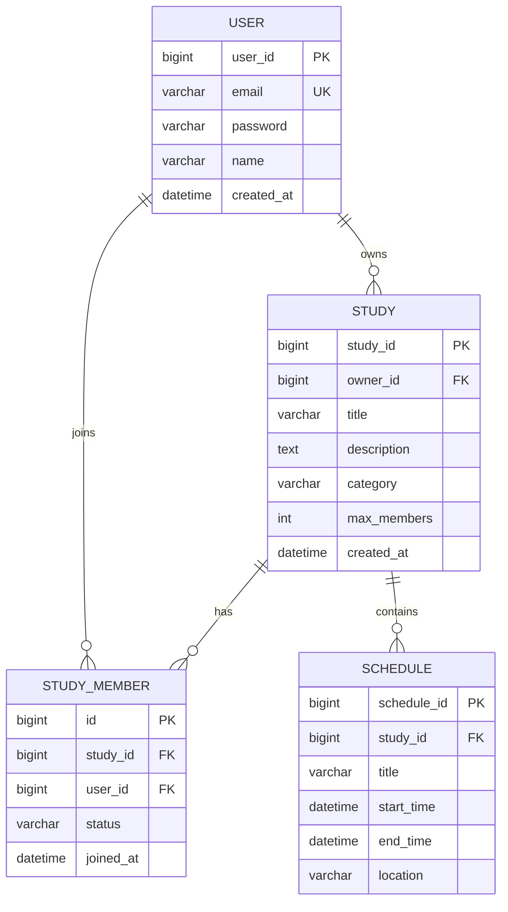

# ERD 및 테이블 정의서 — [프로젝트명]

> **Entity-Relationship Diagram & DDL**
> SW 프레임워크 · **W09 과제** · 제출 기한 **W10 수업 시작 전**
> 한국공학대학교 IT경영전공 · 2026학년도 1학기

---

## 📋 작성 가이드

W08 요구사항 정의서에서 초안 작성한 DB 테이블을 **ERD와 DDL로 확정**합니다.

### 작성 원칙

- **Mermaid 문법**으로 ERD 작성 (GitHub에서 자동 렌더링됨)
- **정규화 3NF 이상** — 중복 데이터 제거
- **FK 관계** 명확히 표기 (1:N · N:M 구분)
- **NOT NULL · UNIQUE · INDEX** 등 제약 조건 명시
- **CREATE TABLE** 스크립트를 MySQL 기준으로 작성

---

## 1. 프로젝트 기본 정보

| 항목 | 내용 |
|---|---|
| 프로젝트명 | [W08 정의서와 동일] |
| 팀명 / 팀장 | [예시] Framework Masters / 홍길동 |
| DB 버전 | MySQL 8.0+ · `character_set = utf8mb4` |
| 테이블 수 | [예시] 4개 (user · study · study_member · schedule) |

---

## 2. ERD (Entity-Relationship Diagram)

> Mermaid 문법으로 작성 → `docs/W09_ERD.md`에 같은 내용으로 업로드 (GitHub 자동 렌더링)

### 2-1. Mermaid ERD 코드



### 2-2. 관계 설명

| 관계 | 유형 | 의미 |
|---|---|---|
| USER — STUDY | 1:N | 1명의 user는 여러 study를 생성할 수 있다 |
| USER — STUDY_MEMBER | 1:N | 1명의 user는 여러 스터디에 참여 가능 |
| STUDY — STUDY_MEMBER — USER | N:M | study_member는 연결 테이블 (N:M을 풀어낸 것) |
| STUDY — SCHEDULE | 1:N | 1개의 study는 여러 schedule을 가진다 |

> **관계선 기호**: `||--o{` (1:N) · `||--||` (1:1) · `}o--o{` (N:M)

---

## 3. 테이블 정의 (상세)

> 모든 테이블에 대해 동일한 형식으로 작성. 아래는 예시.

### 3-1. USER 테이블

| 컬럼명 | 타입 | NULL | KEY | 설명 |
|---|---|---|---|---|
| user_id | BIGINT AUTO_INCREMENT | NO | PK | 사용자 고유 ID |
| email | VARCHAR(100) | NO | UK | 이메일 · 로그인 ID · 중복 불가 |
| password | VARCHAR(100) | NO | — | BCrypt 해시 저장 (60자) |
| name | VARCHAR(50) | NO | — | 사용자 이름 |
| created_at | DATETIME | NO | — | 가입 일시 · DEFAULT NOW() |

### 3-2. STUDY 테이블

| 컬럼명 | 타입 | NULL | KEY | 설명 |
|---|---|---|---|---|
| study_id | BIGINT AUTO_INCREMENT | NO | PK | 스터디 고유 ID |
| owner_id | BIGINT | NO | FK | user.user_id 참조 |
| title | VARCHAR(200) | NO | — | 스터디 제목 |
| description | TEXT | YES | — | 스터디 설명 |
| category | VARCHAR(50) | YES | — | 카테고리 |
| max_members | INT | NO | — | 최대 인원 수 · DEFAULT 10 |
| created_at | DATETIME | NO | — | 생성 일시 |

### 3-3. STUDY_MEMBER 테이블

| 컬럼명 | 타입 | NULL | KEY | 설명 |
|---|---|---|---|---|
| id | BIGINT AUTO_INCREMENT | NO | PK | 멤버십 고유 ID |
| study_id | BIGINT | NO | FK | study.study_id 참조 |
| user_id | BIGINT | NO | FK | user.user_id 참조 |
| status | VARCHAR(20) | NO | — | PENDING / APPROVED / REJECTED |
| joined_at | DATETIME | NO | — | 참여 일시 |

> 추가 테이블도 동일한 형식으로 작성

---

## 4. DDL 스크립트 (MySQL)

> 팀 저장소 `src/main/resources/schema.sql` 또는 `sql/schema.sql`에도 동일하게 저장

```sql
-- 문자셋 설정
CREATE DATABASE IF NOT EXISTS studymate
  CHARACTER SET utf8mb4 COLLATE utf8mb4_unicode_ci;
USE studymate;

-- 1. 사용자 테이블
CREATE TABLE user (
    user_id    BIGINT AUTO_INCREMENT PRIMARY KEY,
    email      VARCHAR(100) NOT NULL UNIQUE,
    password   VARCHAR(100) NOT NULL,
    name       VARCHAR(50)  NOT NULL,
    created_at DATETIME     NOT NULL DEFAULT CURRENT_TIMESTAMP
) ENGINE=InnoDB;

-- 2. 스터디 테이블
CREATE TABLE study (
    study_id     BIGINT AUTO_INCREMENT PRIMARY KEY,
    owner_id     BIGINT        NOT NULL,
    title        VARCHAR(200)  NOT NULL,
    description  TEXT,
    category     VARCHAR(50),
    max_members  INT           NOT NULL DEFAULT 10,
    created_at   DATETIME      NOT NULL DEFAULT CURRENT_TIMESTAMP,
    FOREIGN KEY (owner_id) REFERENCES user(user_id)
) ENGINE=InnoDB;

-- 3. 스터디 멤버 (N:M 연결)
CREATE TABLE study_member (
    id         BIGINT AUTO_INCREMENT PRIMARY KEY,
    study_id   BIGINT      NOT NULL,
    user_id    BIGINT      NOT NULL,
    status     VARCHAR(20) NOT NULL DEFAULT 'PENDING',
    joined_at  DATETIME    NOT NULL DEFAULT CURRENT_TIMESTAMP,
    UNIQUE KEY uk_study_user (study_id, user_id),
    FOREIGN KEY (study_id) REFERENCES study(study_id),
    FOREIGN KEY (user_id)  REFERENCES user(user_id)
) ENGINE=InnoDB;

-- 4. 일정 테이블
CREATE TABLE schedule (
    schedule_id BIGINT AUTO_INCREMENT PRIMARY KEY,
    study_id    BIGINT       NOT NULL,
    title       VARCHAR(200) NOT NULL,
    start_time  DATETIME     NOT NULL,
    end_time    DATETIME     NOT NULL,
    location    VARCHAR(200),
    FOREIGN KEY (study_id) REFERENCES study(study_id)
) ENGINE=InnoDB;
```

### 4-1. 초기 데이터 (선택)

```sql
-- 테스트 계정
INSERT INTO user (email, password, name) VALUES
  ('admin@test.com', '$2a$10$...', '관리자'),
  ('guest@test.com', '$2a$10$...', '게스트');
```

---

## 5. MyBatis 매핑 참고 (선택)

```java
// src/main/java/kr/ac/tukorea/swframework/domain/User.java
public class User {
    private Long userId;
    private String email;
    private String password;
    private String name;
    private LocalDateTime createdAt;
    // getter/setter 생략
}
```

---

## ✅ 제출 전 체크리스트

- [ ] Mermaid ERD 코드 작성 (GitHub에서 렌더링 확인)
- [ ] 모든 테이블에 PK 정의
- [ ] FK 관계 표시 및 참조 무결성 확인
- [ ] NOT NULL · UNIQUE 제약 조건 명시
- [ ] CREATE TABLE DDL 작성 (MySQL 기준)
- [ ] W08 요구사항 정의서의 테이블 초안과 일치
- [ ] DDL 실행 테스트 완료 (MySQL에서 오류 없이 생성)
- [ ] 파일명: `ERD_테이블정의서_팀명.docx`
- [ ] GitHub 저장소 `docs/W09_ERD.md`로도 업로드
