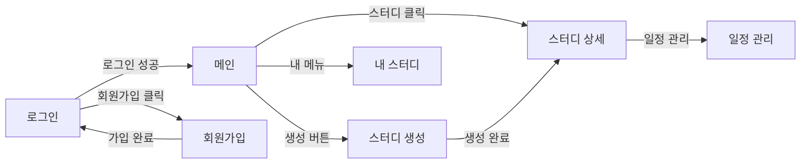

# 화면설계서 — [프로젝트명]

> **Screen Design (Wireframe)**
> SW 프레임워크 · **W10 과제 (Part 1)** · 제출 기한 **W11 수업 시작 전**
> 한국공학대학교 IT경영전공 · 2026학년도 1학기

---

## 📋 작성 가이드

화면 흐름과 UI 요소를 정의합니다. 본 문서를 바탕으로 W10~W11 구현이 진행됩니다.
**API 명세는 `API_명세서.md`에 별도 작성**합니다 (W10 과제 Part 2).

### 작성 원칙

- **주요 화면 5~8개** 정의 (Must 기능 중심)
- 각 화면마다 **ID · URL · 접근 권한 · UI 요소** 명시
- **화면 흐름도(Flow)** 를 Mermaid 또는 이미지로 작성
- 지금 설계한 URL이 W10~W11 Controller `@GetMapping`/`@PostMapping`이 됩니다

---

## 1. 프로젝트 기본 정보

| 항목 | 내용 |
|---|---|
| 프로젝트명 | [W08 정의서와 동일] |
| 팀명 / 팀장 | [예시] Framework Masters / 홍길동 |
| 화면 수 | [예시] 7개 |
| 와이어프레임 도구 | [예시] Figma · draw.io · ASCII |

---

## 2. 화면 목록

> Must 기능 우선으로 5~8개 화면을 정의합니다. 화면 ID는 `S-001`부터 순차 부여.

| 화면 ID | 화면명 | URL | 접근 권한 | 관련 기능 (W08 ID) |
|---|---|---|---|---|
| S-001 | 로그인 | `/login` | 비로그인 | F-002 |
| S-002 | 회원가입 | `/signup` | 비로그인 | F-001 |
| S-003 | 메인 (스터디 목록) | `/` | 로그인 | F-003, F-006, F-007 |
| S-004 | 스터디 상세 | `/study/{id}` | 로그인 | F-003, F-004 |
| S-005 | 스터디 생성 | `/study/new` | 로그인 | F-003 |
| S-006 | 일정 관리 | `/study/{id}/schedules` | 로그인 | F-005 |
| S-007 | 내 스터디 목록 | `/my/studies` | 로그인 | F-004 |

---

## 3. 화면 흐름도

> Mermaid flowchart 또는 Figma 이미지를 삽입합니다.



---

## 4. 공통 레이아웃

### 4-1. 네비게이션 바 (전체 페이지 공통)

```
┌──────────────────────────────────────────────────────────────────┐
│  [프로젝트명]      [메뉴1]    [메뉴2]    [로그인 / 로그아웃]        │
└──────────────────────────────────────────────────────────────────┘
```

**동작 규칙:**

- **비로그인 상태**: 로그인 / 회원가입 링크만 표시
- **로그인 상태**: 사용자명 · 내 메뉴 · 로그아웃 버튼 표시

---

## 5. 주요 화면 상세

> 5~8개 화면 중 **2~3개**를 상세하게 작성. 나머지는 화면 목록 표로 충분.

### S-001: 로그인

| 항목 | 내용 |
|---|---|
| 화면명 | 로그인 (Login) |
| URL | `GET /login` · `POST /login` |
| 접근 권한 | 비로그인 |
| UI 요소 | 이메일 입력란 · 비밀번호 입력란 · 로그인 버튼 · 회원가입 링크 · 에러 메시지 영역 |
| 유효성 검사 | 이메일 형식 · 비밀번호 8자 이상 · 모두 필수 입력 |
| 성공 시 | 세션 생성 → `redirect:/` (메인 페이지) |
| 실패 시 | `redirect:/login?error` → 에러 메시지 표시 (`th:if`) |

**와이어프레임:**

```
┌──────────────────────────────────────────────────────────────────┐
│  [네비게이션 바]                                                   │
├──────────────────────────────────────────────────────────────────┤
│                                                                  │
│                          로그인                                   │
│                                                                  │
│              ┌─────────────────────────┐                         │
│  이메일       │                         │                         │
│              └─────────────────────────┘                         │
│              ┌─────────────────────────┐                         │
│  비밀번호     │                         │                         │
│              └─────────────────────────┘                         │
│                                                                  │
│              [회원가입]              [로그인]                      │
│                                                                  │
└──────────────────────────────────────────────────────────────────┘
```

### S-003: 메인 — 스터디 목록

| 항목 | 내용 |
|---|---|
| 화면명 | 메인 — 스터디 목록 |
| URL | `GET /?page=1&size=10&keyword=` |
| 접근 권한 | 로그인 필수 · 비로그인 시 인터셉터가 `/login`으로 리다이렉트 |
| UI 요소 | 상단 네비바 (로고·내 스터디·로그아웃) · 검색창 · 카테고리 필터 · 스터디 카드 리스트 · 페이징 UI · 새 스터디 버튼 |
| 데이터 | `Model: List<Study> studies · int totalPages · int currentPage · String keyword` |

> 나머지 화면(S-002 · S-004 ~ S-007)도 동일한 형식으로 작성합니다.

---

## ✅ 제출 전 체크리스트

- [ ] 주요 화면 5~8개 정의 (ID · URL · 접근 권한)
- [ ] 화면 흐름도 작성 (Mermaid 또는 이미지)
- [ ] 주요 화면 2~3개의 상세 명세 작성
- [ ] 공통 레이아웃(네비게이션 바) 정의
- [ ] W08 요구사항 정의서 기능 ID와 매칭
- [ ] PRG 패턴 적용 화면 표시 (POST 성공 후 redirect)
- [ ] 파일명: `화면설계서_API명세_팀명.docx` (Part 1)
- [ ] GitHub 저장소 `docs/W10_화면설계서.md`로 업로드
- [ ] API 명세서는 별도 `docs/W10_API_명세서.md`로 작성 (W10 Part 2)
