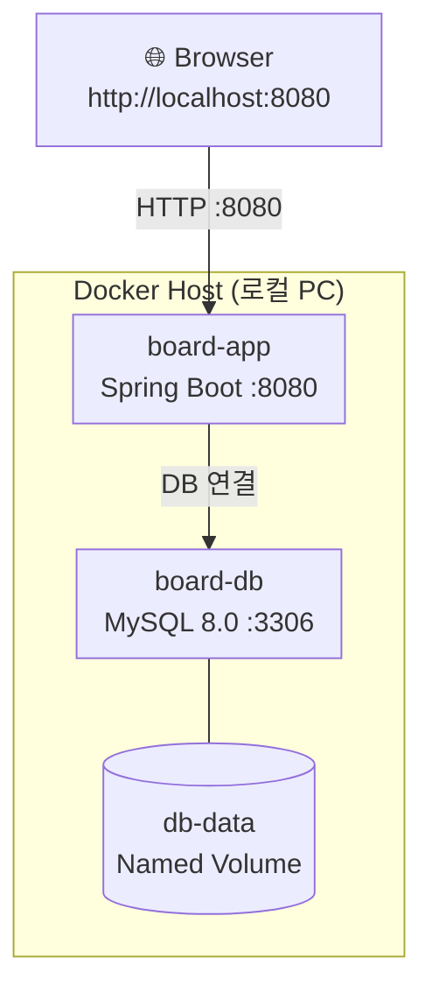

# 배포 계획서

| 항목 | 내용 |
|---|---|
| 프로젝트명 | SW프레임워크 게시판 프로젝트 |
| 문서 버전 | 1.0 |
| 작성일 | 2026-06-XX |
| 작성자 | (팀명 / 작성자명) |
| 배포 대상 환경 | 로컬 Docker |

---

## 1. 배포 환경

| 항목 | 사양 |
|---|---|
| 배포 방식 | Docker 컨테이너 (로컬) |
| 앱 컨테이너 | Spring Boot 3.5.11 + Java 21 (eclipse-temurin:21-jre) |
| DB 컨테이너 | MySQL 8.0 |
| 앱 포트 | 호스트 8080 → 컨테이너 8080 |
| DB 포트 | 호스트 3306 → 컨테이너 3306 |
| 데이터 영속화 | Docker Named Volume (`db-data`) |

### 아키텍처 구성도



---

## 2. 사전 준비

### 2.1 필수 설치 소프트웨어

| 소프트웨어 | 버전 | 확인 명령어 |
|---|---|---|
| Docker Desktop | 최신 | `docker --version` |
| Docker Compose | v2 이상 (Docker Desktop에 포함) | `docker compose version` |
| JDK | 21 | `java -version` |
| Gradle | Wrapper 사용 (별도 설치 불필요) | `./gradlew --version` |

### 2.2 사전 확인 사항

```bash
# Docker Desktop이 실행 중인지 확인
docker info

# 포트 충돌 확인 — 8080, 3306 포트가 사용 중이면 안 됨
# Windows PowerShell
netstat -ano | findstr :8080
netstat -ano | findstr :3306

# macOS / Linux
lsof -i :8080
lsof -i :3306
```

> **주의**: 로컬에 MySQL이 이미 실행 중이면 3306 포트가 충돌한다. 로컬 MySQL 서비스를 중지하거나 `docker-compose.yml`에서 포트를 `3307:3306`으로 변경한다.

---

## 3. 빌드 절차

### 3.1 소스 코드 준비

```bash
# 프로젝트 디렉토리로 이동
cd code/complete
```

### 3.2 JAR 빌드

```bash
# Windows PowerShell
.\gradlew.bat clean bootJar

# macOS / Linux
./gradlew clean bootJar
```

### 3.3 빌드 결과 확인

```bash
# 빌드 산출물 확인 — JAR 파일이 생성되었는지 검증
ls build/libs/
# 예상 출력: sw-framework-1.0.0.jar
```

> **주의**: `build` 대신 `bootJar`를 사용한다. `bootJar`는 실행 가능한(fat) JAR을 생성하고, 일반 `jar` 태스크는 Spring Boot 실행에 필요한 의존성을 포함하지 않는다.

---

## 4. Docker 배포

### 4.1 방법 A: Docker Compose (권장)

앱 컨테이너와 DB 컨테이너를 한 번에 실행하는 방식이다.

#### Dockerfile (프로젝트 루트에 존재)

```dockerfile
# Dockerfile — Spring Boot 애플리케이션 컨테이너화
# 사용법: ./gradlew bootJar && docker build -t swframework:1.0 .

# 1단계: 베이스 이미지 — Java 21 런타임 (JRE만 포함하여 이미지 크기 최소화)
FROM eclipse-temurin:21-jre

# 2단계: 작업 디렉토리 설정
WORKDIR /app

# 3단계: 빌드된 JAR 파일을 컨테이너 내부로 복사
COPY build/libs/*.jar app.jar

# 4단계: 컨테이너가 사용할 포트 명시
EXPOSE 8080

# 5단계: 컨테이너 시작 시 실행할 명령어
# Spring 프로파일을 docker로 지정하여 application-docker.yml 사용
ENTRYPOINT ["java", "-jar", "-Dspring.profiles.active=docker", "app.jar"]
```

#### docker-compose.yml (프로젝트 루트에 존재)

```yaml
# docker-compose.yml — Spring Boot 앱 + MySQL DB 동시 실행
# 사용법: docker compose up -d --build

services:
  # MySQL 컨테이너
  db:
    image: mysql:8.0
    container_name: board-db
    environment:
      MYSQL_ROOT_PASSWORD: 1234
      MYSQL_DATABASE: swframework
    ports:
      - "3306:3306"
    volumes:
      - db-data:/var/lib/mysql
      - ./sql/schema.sql:/docker-entrypoint-initdb.d/schema.sql

  # Spring Boot 앱 컨테이너
  app:
    build: .
    container_name: board-app
    ports:
      - "8080:8080"
    environment:
      DB_HOST: db
      DB_USER: root
      DB_PASS: 1234
    depends_on:
      - db

volumes:
  db-data:
```

#### 실행 명령

```bash
# 빌드 + 컨테이너 시작 (백그라운드)
docker compose up -d --build

# 로그 확인 (앱 컨테이너)
docker logs -f board-app

# 로그 확인 (DB 컨테이너)
docker logs -f board-db
```

### 4.2 방법 B: Docker 단독 실행 (수동)

DB를 로컬에서 직접 실행하고 앱 컨테이너만 사용하는 방식이다.

```bash
# 1. Docker 이미지 빌드
docker build -t board-app:1.0 .

# 2. 컨테이너 실행 (로컬 MySQL 사용 시)
docker run -d \
  --name board-app \
  -p 8080:8080 \
  -e DB_HOST=host.docker.internal \
  -e DB_USER=root \
  -e DB_PASS=1234 \
  board-app:1.0

# Windows PowerShell (줄 이음 문자 차이)
docker run -d `
  --name board-app `
  -p 8080:8080 `
  -e DB_HOST=host.docker.internal `
  -e DB_USER=root `
  -e DB_PASS=1234 `
  board-app:1.0
```

---

## 5. 접속 확인

### 5.1 서비스 상태 확인

```bash
# 컨테이너 실행 상태 확인
docker ps

# 예상 출력:
# CONTAINER ID   IMAGE        ...  STATUS         PORTS                    NAMES
# xxxxxxxxxxxx   board-app    ...  Up 2 minutes   0.0.0.0:8080->8080/tcp   board-app
# xxxxxxxxxxxx   mysql:8.0    ...  Up 2 minutes   0.0.0.0:3306->3306/tcp   board-db
```

### 5.2 웹 브라우저 접속

| 확인 항목 | URL | 기대 결과 |
|---|---|---|
| 메인 페이지 | http://localhost:8080 | 로그인 페이지 표시 |
| 로그인 | admin / 1234 입력 | 게시판 목록 페이지 이동 |
| 게시판 목록 | http://localhost:8080/board/list | 초기 데이터 3건 표시 |
| 글 작성 | 새 글 작성 후 목록 확인 | 작성한 글 목록에 표시 |

### 5.3 헬스 체크 (커맨드 라인)

```bash
# curl로 접속 확인
curl -s -o /dev/null -w "%{http_code}" http://localhost:8080
# 기대 출력: 200 또는 302 (로그인 리다이렉트)
```

---

## 6. 롤백 절차

배포 후 문제 발생 시 이전 버전으로 복원하는 절차이다.

### 6.1 Docker Compose 환경

```bash
# 1. 현재 컨테이너 중지 및 제거
docker compose down

# 2. 이전 버전 JAR로 재빌드 (Git에서 이전 커밋 체크아웃)
git checkout <이전커밋해시>
./gradlew clean bootJar

# 3. 재배포
docker compose up -d --build
```

### 6.2 이미지 태그를 활용한 롤백

```bash
# 이전 버전 이미지가 남아있는 경우
docker images | grep board-app

# 이전 이미지로 컨테이너 교체
docker stop board-app
docker rm board-app
docker run -d --name board-app -p 8080:8080 board-app:<이전태그>
```

### 6.3 데이터베이스 롤백

```bash
# DB 볼륨 초기화 (데이터 전체 삭제 후 스키마 재생성)
docker compose down -v    # -v 옵션: 볼륨도 함께 삭제
docker compose up -d      # schema.sql이 자동 재실행됨
```

> **주의**: `-v` 옵션은 볼륨 데이터를 모두 삭제한다. 중요한 데이터가 있으면 먼저 백업한다.
>
> ```bash
> # DB 백업 (롤백 전 실행)
> docker exec board-db mysqldump -u root -p1234 swframework > backup.sql
> ```

---

## 7. 배포 체크리스트

### 배포 전 확인

- [ ] 소스 코드가 최신 상태인가 (`git pull`)
- [ ] 모든 테스트가 통과하는가 (`./gradlew test`)
- [ ] JAR 빌드가 정상 완료되는가 (`./gradlew clean bootJar`)
- [ ] `application-docker.yml` 설정이 올바른가 (DB 호스트, 포트)
- [ ] Docker Desktop이 실행 중인가
- [ ] 8080, 3306 포트가 사용 가능한가
- [ ] `sql/schema.sql`에 필요한 테이블과 초기 데이터가 포함되어 있는가

### 배포 후 확인

- [ ] `docker ps`에서 board-app, board-db 컨테이너가 모두 Up 상태인가
- [ ] http://localhost:8080 접속이 되는가
- [ ] admin/1234로 로그인이 되는가
- [ ] 게시판 CRUD(작성/조회/수정/삭제)가 정상 동작하는가
- [ ] 검색 기능이 정상 동작하는가
- [ ] 컨테이너 로그에 에러가 없는가 (`docker logs board-app`)

---

> 문서 끝
