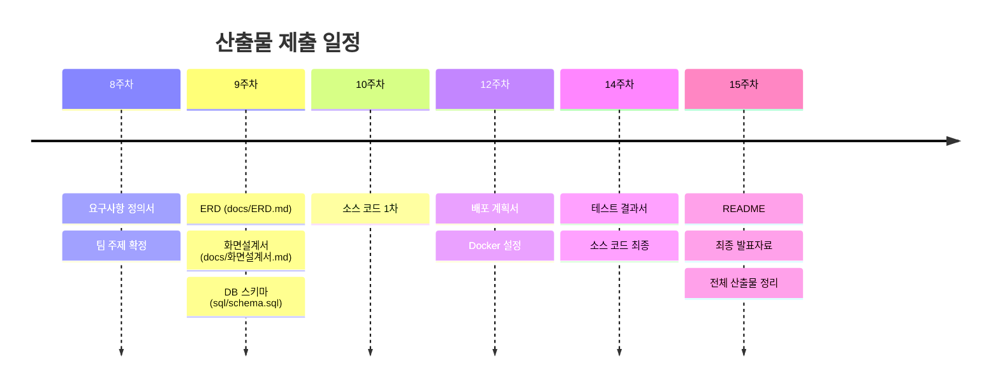

# 팀 프로젝트 산출물 목록

| 항목 | 내용 |
|---|---|
| 과목명 | SW프레임워크 |
| 학기 | 2026학년도 1학기 |
| 프로젝트명 | (팀별 프로젝트명) |
| 최종 갱신일 | 2026-06-XX |

---

## 산출물 일람표

| 순번 | 분류 | 산출물명 | 파일명 | 제출 주차 | 담당 | 상태 |
|---|---|---|---|---|---|---|
| 1 | 기획 | 제안요청서(RFP) | `RFP_게시판프로젝트.md` | 1주차 (참고) | 교수 제공 | 제공완료 |
| 2 | 기획 | 요구사항 정의서 | `요구사항_정의서.md` | 8주차 | 팀 전체 | |
| 3 | 설계 | ERD (데이터베이스 설계) | `docs/ERD.md` (Mermaid) | 9주차 | DB 담당 | |
| 4 | 설계 | 화면 설계서 (와이어프레임) | `docs/화면설계서.md` | 9주차 | 프론트엔드 담당 | |
| 5 | 설계 | API 명세서 | `docs/화면설계서.md` (HTTP API 요약 포함) | 10주차 | 백엔드 담당 | 화면설계서에 포함 |
| 6 | 구현 | 소스 코드 (백엔드) | `src/main/java/...` | 10~14주차 | 백엔드 담당 | |
| 7 | 구현 | 소스 코드 (프론트엔드) | `src/main/resources/templates/...` | 10~14주차 | 프론트엔드 담당 | |
| 8 | 구현 | DB 스키마 스크립트 | `sql/schema.sql` | 9주차 | DB 담당 | |
| 9 | 구현 | 빌드 설정 파일 | `build.gradle`, `settings.gradle` | 2주차~ | 팀장 | |
| 10 | 구현 | Docker 설정 | `Dockerfile`, `docker-compose.yml` | 12주차 | 인프라 담당 | |
| 11 | 테스트 | 테스트 결과서 | `docs/테스트_결과서.md` | 14주차 | 팀 전체 | |
| 12 | 배포 | 배포 계획서 | `docs/배포_계획서.md` | 12주차 | 인프라 담당 | |
| 13 | 관리 | 회의록 | `docs/회의록_N차.md` | 매주 | 팀장 (돌아가며) | |
| 14 | 관리 | README | `README.md` | 15주차 | 팀장 | |
| 15 | 발표 | 최종 발표자료 | `docs/최종_발표.pdf` 또는 `.pptx` | 15주차 | 팀 전체 | |

---

## 산출물 상세 설명

### 1. 제안요청서(RFP)

- **설명**: 프로젝트의 배경, 목표, 기능 범위를 정의한 문서. 교수가 제공하며 팀의 요구사항 정의 출발점이 된다.
- **제출 형태**: 참고용 (별도 제출 불필요)

### 2. 요구사항 정의서

- **설명**: RFP를 기반으로 팀이 구체화한 기능/비기능 요구사항 목록. 우선순위, 담당자, 구현 여부를 추적한다.
- **제출 시기**: 8주차 (중간고사 + 팀 프로젝트 주제 선정)
- **포함 항목**: 요구사항 ID, 분류, 상세 내용, 우선순위, 담당자

### 3. ERD

- **설명**: 테이블 구조, 컬럼 정의, 관계(PK/FK)를 시각화한 다이어그램.
- **도구**: MySQL Workbench, draw.io, Mermaid 등

### 4. 화면 설계서

- **설명**: 주요 화면(로그인, 목록, 상세, 작성/수정)의 레이아웃과 UI 요소를 정의한다.
- **도구**: Figma, draw.io, 손 스케치 스캔 등

### 5. API 명세서

- **설명**: 각 URL 경로의 HTTP 메서드, 요청 파라미터, 응답 형태를 정리한다.
- **포함 항목**: URL, Method, 파라미터, 응답 예시, 비고

### 6~10. 소스 코드 및 설정 파일

- **설명**: 실제 구현 코드. GitHub 저장소에 커밋 이력과 함께 관리한다.
- **주의**: `.gitignore`로 빌드 산출물, IDE 설정, 환경변수 파일 제외

### 11. 테스트 결과서

- **설명**: 기능/비기능 테스트 케이스와 실행 결과, 결함 목록을 기록한다.
- **템플릿**: `docs/테스트_결과서_템플릿.md` 참고

### 12. 배포 계획서

- **설명**: Docker 기반 배포 환경, 빌드/실행 절차, 롤백 방안을 기술한다.
- **템플릿**: `docs/배포_계획서_템플릿.md` 참고

### 13. 회의록

- **설명**: 주간 회의 내용(안건, 진행 상황, 의사결정, Action Item)을 기록한다.
- **템플릿**: `docs/회의록_템플릿.md` 참고
- **제출**: 매주 회의 후 GitHub에 커밋 (파일명: `회의록_N차.md`)

### 14. README

- **설명**: 프로젝트 소개, 실행 방법, 기술 스택, 팀원 역할을 정리한 문서.
- **포함 항목**: 프로젝트 개요, 기술 스택, 실행 방법, 팀원 소개, 화면 캡처

### 15. 최종 발표자료

- **설명**: 15주차 최종 발표용 자료. 시연 포함 10분 분량.
- **포함 항목**: 프로젝트 소개, 아키텍처, 핵심 기능 시연, ERD, 팀원 역할, 회고

---

## 제출 일정 요약

---

## 평가 반영

| 평가 항목 | 비중 | 관련 산출물 |
|---|---|---|
| 기말(팀프로젝트) | 30% | 소스 코드, 배포, 테스트 결과서, 발표자료 |
| 과제 | 20% | 요구사항 정의서, 설계 문서, 주차별 과제 |
| 발표 | 10% | 최종 발표자료, 시연 |
| 수시(Q&A) | 10% | 회의록, 수업 참여도 |

---

> 문서 끝
