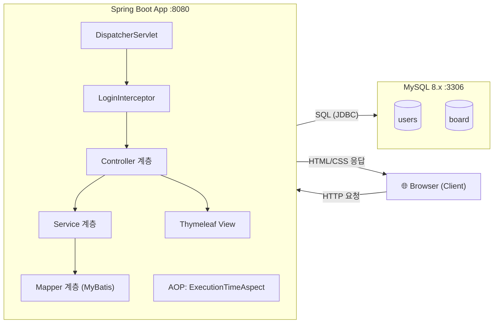
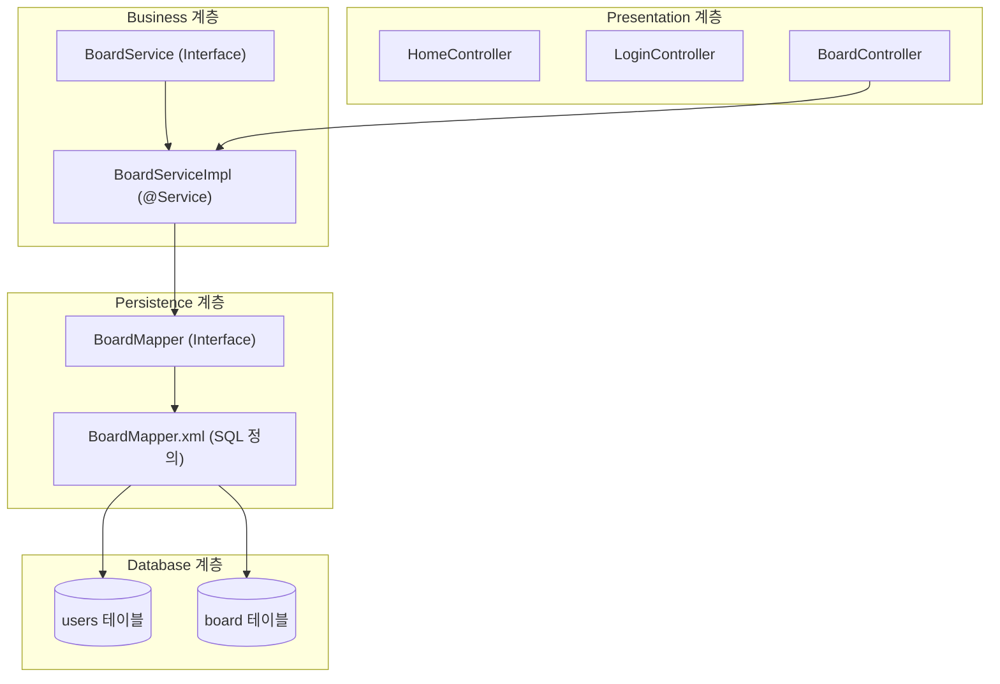
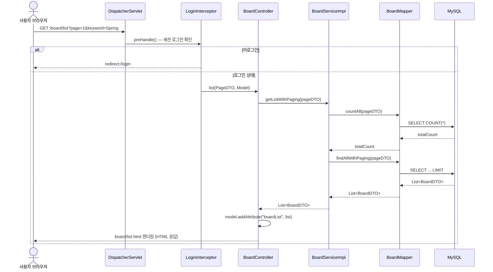
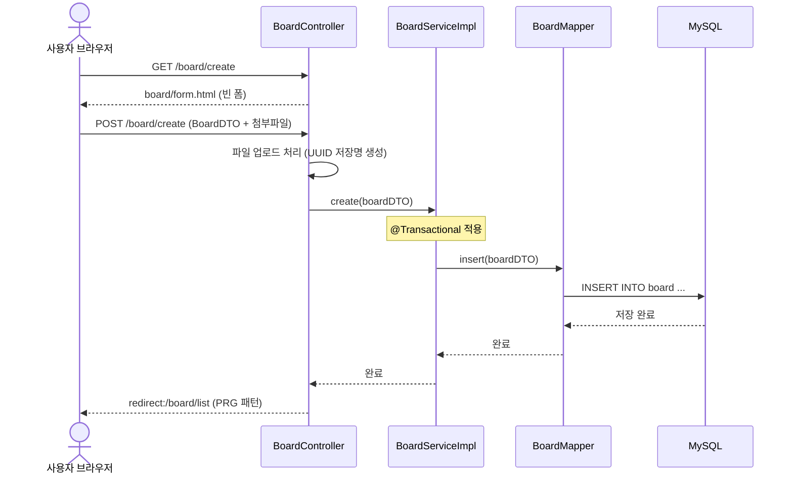
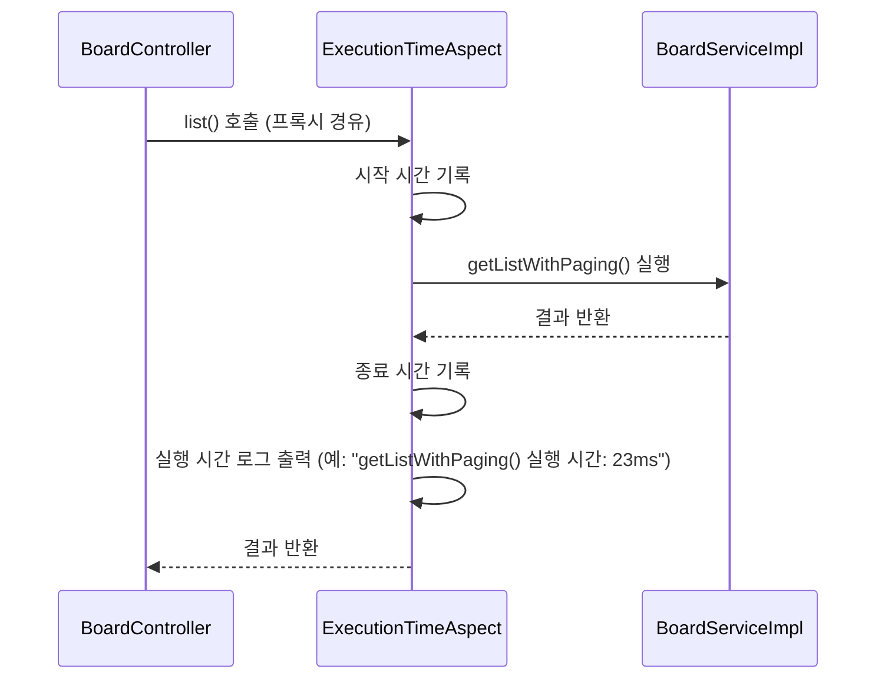
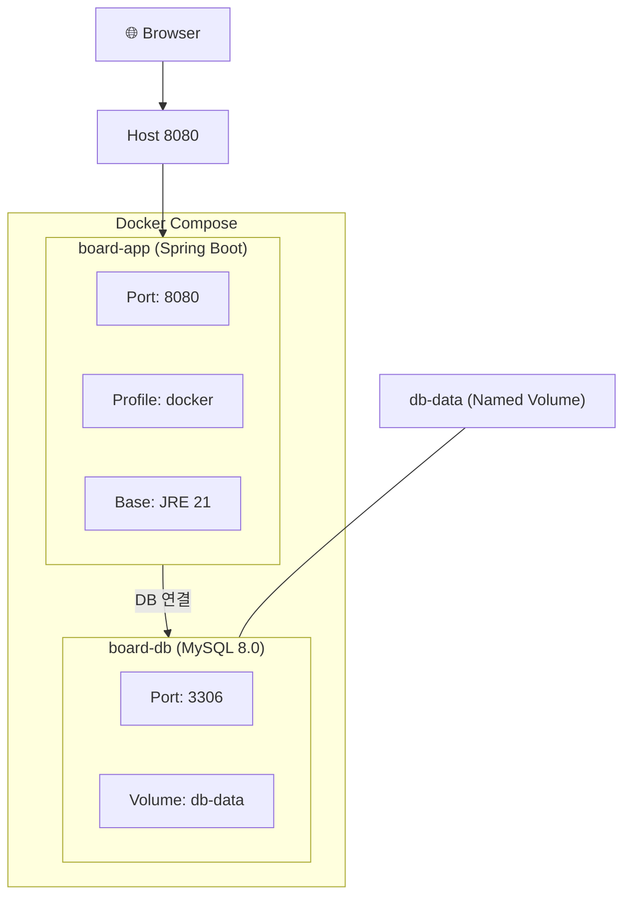
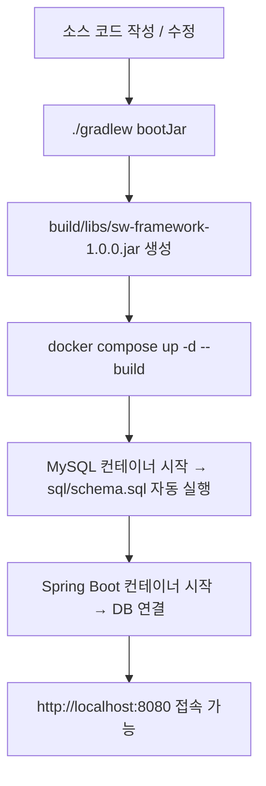
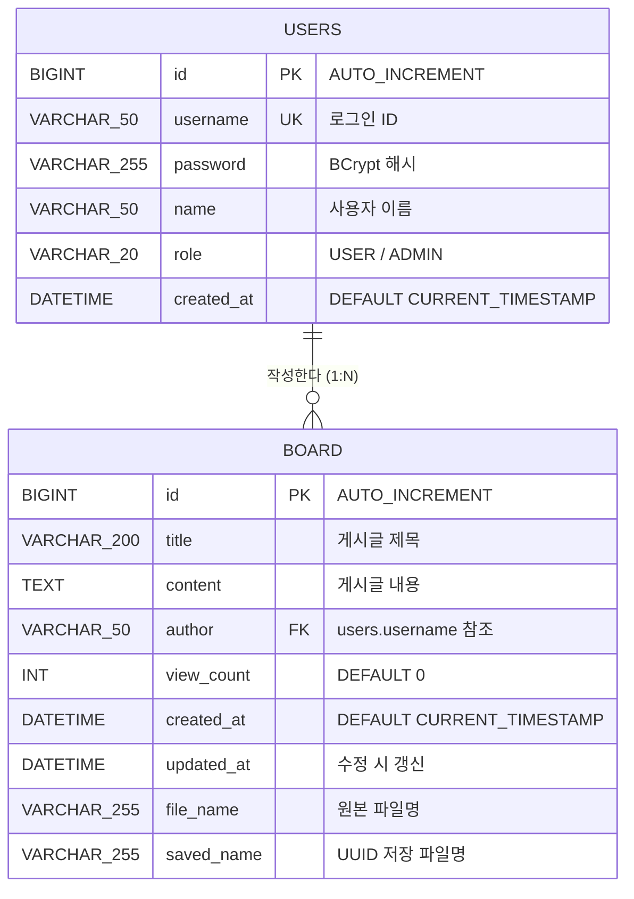

# 아키텍처 정의서 — SW프레임워크 게시판 프로젝트

> **문서 버전**: 1.0
> **작성일**: 2026-02-20
> **과목**: SW프레임워크 | 2026-1학기 | 한국공학대학교 IT경영전공
> **프로젝트명**: Spring Boot 게시판

---

## 1. 시스템 개요

### 1.1 목적

본 프로젝트는 한국공학대학교 SW프레임워크 수업의 팀 프로젝트로서, Spring Boot 기반 웹 게시판 시스템을 구현한다. 학생들이 한 학기 동안 학습한 백엔드 프레임워크(Spring Boot), 데이터베이스(MyBatis + MySQL), 프론트엔드(Thymeleaf), 인프라(Docker, CI/CD) 기술을 종합 적용하는 것을 목표로 한다.

### 1.2 범위

| 구분 | 포함 | 제외 |
|---|---|---|
| 기능 | 게시글 CRUD, 검색, 페이징, 정렬, 세션 기반 로그인/로그아웃, BCrypt 암호화, 다국어(i18n), 파일 업로드/다운로드 | 댓글, 알림, 회원가입UI |
| 인프라 | Docker 컨테이너화, GitHub Actions CI | 클라우드 배포(AWS/GCP), 무중단 배포 |
| 보안 | 세션 인증, 인터셉터 접근 제어, SQL Injection 방지 | Spring Security, OAuth2, JWT 토큰 인증 |

### 1.3 용어 정의

| 용어 | 설명 |
|---|---|
| MVC | 모델-뷰-컨트롤러(Model-View-Controller) 패턴. 관심사를 분리하여 유지보수성을 높이는 아키텍처 패턴 |
| IoC/DI | 제어의 역전(Inversion of Control) / 의존성 주입(Dependency Injection). Spring 프레임워크의 핵심 원리 |
| AOP | 관점 지향 프로그래밍(Aspect-Oriented Programming). 공통 관심사(로깅, 트랜잭션 등)를 분리하는 기법 |
| DTO | 데이터 전송 객체(Data Transfer Object). 계층 간 데이터 전달에 사용하는 객체 |
| Mapper | MyBatis에서 SQL과 Java 메서드를 매핑하는 인터페이스 |
| Thymeleaf | Spring Boot와 통합되는 서버사이드 템플릿 엔진 |
| 인터셉터(Interceptor) | Spring MVC에서 Controller 실행 전/후에 공통 로직을 수행하는 컴포넌트 |

---

## 2. 아키텍처 원칙

### 2.1 MVC 패턴 적용

모든 웹 요청은 MVC 패턴에 따라 처리한다.

- **Model**: DTO 객체가 데이터를 운반하며, Service 계층이 비즈니스 로직을 담당한다
- **View**: Thymeleaf 템플릿이 HTML을 렌더링한다
- **Controller**: HTTP 요청을 받아 적절한 Service를 호출하고 View에 데이터를 전달한다

### 2.2 계층 분리 원칙

각 계층은 자신의 역할만 수행하며, 상위 계층에서 하위 계층으로만 의존한다.

```
Controller → Service → Mapper(Repository)
     ↓
    View
```

- Controller는 Mapper를 직접 호출하지 않는다
- Service는 HttpServletRequest 등 웹 관련 객체에 의존하지 않는다
- Mapper는 SQL 실행만 담당하며 비즈니스 로직을 포함하지 않는다

### 2.3 의존성 주입(DI) 원칙

- 모든 의존성은 **생성자 주입(Constructor Injection)** 방식을 사용한다
- 인터페이스 기반 설계: Service 계층은 인터페이스(`BoardService`)와 구현체(`BoardServiceImpl`)를 분리한다
- Spring 컨테이너가 Bean의 생명주기를 관리한다

### 2.4 설정 분리 원칙

- 환경별 설정 파일 분리: `application.yml`(로컬), `application-docker.yml`(Docker), `application-test.yml`(테스트)
- 하드코딩 금지: DB 접속 정보, 포트 번호 등은 설정 파일 또는 환경 변수로 관리한다

---

## 3. 시스템 구성도

### 3.1 전체 구성



### 3.2 계층 구조도



---

## 4. 계층별 설계

### 4.1 Controller 계층 (Presentation)

**역할**: HTTP 요청을 수신하고, Service를 호출한 후, View에 결과를 전달한다.

| 클래스 | URL 매핑 | 주요 기능 |
|---|---|---|
| `HomeController` | `GET /` | 홈 페이지 렌더링 |
| `LoginController` | `GET/POST /login`, `POST /logout` | 로그인 폼 표시, 인증 처리, 로그아웃(세션 무효화) |
| `BoardController` | `/board/**` | 게시글 목록, 상세, 등록, 수정, 삭제 |
| `GreetingController` | `GET /greeting` | IoC/DI 시연 (Week 04) — @Primary KoreanGreetingService 주입 |

**BoardController 상세 URL 매핑**:

| HTTP Method | URL | 기능 |
|---|---|---|
| GET | `/board/list` | 게시글 목록 (검색, 페이징, 정렬 포함) |
| GET | `/board/detail/{id}` | 게시글 상세 조회 |
| GET | `/board/create` | 게시글 등록 폼 |
| POST | `/board/create` | 게시글 등록 처리 (파일 업로드 지원) |
| GET | `/board/edit/{id}` | 게시글 수정 폼 |
| POST | `/board/edit/{id}` | 게시글 수정 처리 |
| POST | `/board/delete/{id}` | 게시글 삭제 |
| GET | `/board/download/{savedName}` | 첨부파일 다운로드 |

**설계 규칙**:
- Controller는 비즈니스 로직을 포함하지 않는다
- 입력 검증은 `@Valid` + Bean Validation으로 처리한다
- `Model` 객체를 통해 View에 데이터를 전달한다
- Service 의존성은 생성자 주입으로 주입받는다

### 4.2 Service 계층 (Business)

**역할**: 비즈니스 로직을 수행하고, 트랜잭션 경계를 관리한다.

| 인터페이스 | 구현체 | 주요 메서드 |
|---|---|---|
| `BoardService` | `BoardServiceImpl` | `getListWithPaging()`, `getTotalCount()`, `getDetail()`, `create()`, `modify()`, `remove()` |
| `GreetingService` | `KoreanGreetingService` (@Primary) | `greet(String name)` — 한국어 인사말 |
| `GreetingService` | `EnglishGreetingService` | `greet(String name)` — 영어 인사말 |

**설계 규칙**:
- 인터페이스와 구현체를 분리하여 느슨한 결합(Loose Coupling)을 유지한다
- 구현체에 `@Service` 어노테이션을 부착한다
- 데이터 변경 메서드는 `@Transactional`을 적용한다
- 하나의 Service 메서드에서 여러 Mapper 메서드를 호출할 수 있다

### 4.3 Mapper 계층 (Persistence / Repository)

**역할**: 데이터베이스와의 CRUD 작업을 담당한다. MyBatis를 사용하여 SQL을 실행한다.

| 파일 | 역할 |
|---|---|
| `BoardMapper.java` | Mapper 인터페이스 — Java 메서드 시그니처 정의 (`@Mapper`) |
| `BoardMapper.xml` | XML Mapper — SQL 쿼리 정의 (Dynamic SQL 포함) |

**주요 SQL 매핑**:

| 메서드 | SQL | 설명 |
|---|---|---|
| `findAllWithPaging(PageDTO)` | SELECT + WHERE + ORDER BY + LIMIT/OFFSET | 페이징 + 검색 + 정렬 |
| `findById(Long)` | SELECT WHERE id = #{id} | 단건 조회 |
| `insert(BoardDTO)` | INSERT INTO board | 게시글 등록 |
| `update(BoardDTO)` | UPDATE board SET ... WHERE id | 게시글 수정 |
| `delete(Long)` | DELETE FROM board WHERE id | 게시글 삭제 |
| `countAll(PageDTO)` | SELECT COUNT(*) + WHERE | 검색 조건별 총 건수 (페이징용) |

**설계 규칙**:
- Mapper 인터페이스에 `@Mapper` 어노테이션을 부착한다
- SQL은 XML 파일에 작성하여 Java 코드와 분리한다
- 동적 조건은 MyBatis `<if>`, `<choose>`, `<where>` 태그를 사용한다
- `map-underscore-to-camel-case: true` 설정으로 DB 컬럼(snake_case)과 Java 필드(camelCase)를 자동 매핑한다

### 4.4 View 계층 (Thymeleaf)

**역할**: 서버에서 렌더링한 HTML을 클라이언트에 반환한다.

| 템플릿 파일 | 경로 | 기능 |
|---|---|---|
| `index.html` | `templates/` | 홈 페이지 |
| `login.html` | `templates/` | 로그인 폼 |
| `list.html` | `templates/board/` | 게시글 목록 (검색, 페이징, 정렬 UI) |
| `detail.html` | `templates/board/` | 게시글 상세 조회 |
| `form.html` | `templates/board/` | 게시글 등록/수정 폼 |

**설계 규칙**:
- Thymeleaf 표준 문법(`th:text`, `th:each`, `th:if`, `th:href`)을 사용한다
- CSS는 `static/css/style.css`로 분리한다
- 폼 데이터 바인딩은 `th:object`와 `th:field`를 사용한다

---

## 5. 패키지 구조

```
kr.ac.tukorea.swframework
├── SwFrameworkApplication.java        # Spring Boot 진입점 (@SpringBootApplication)
│
├── config/                            # 설정 클래스
│   ├── AppConfig.java                 # @Bean 수동 등록 (필요 시)
│   └── WebConfig.java                 # WebMvcConfigurer 구현 (인터셉터 등록)
│
├── controller/                        # 프레젠테이션 계층 — HTTP 요청/응답 처리
│   ├── HomeController.java            # 홈 페이지 (GET /)
│   ├── LoginController.java           # 로그인/로그아웃 (GET/POST /login, POST /logout)
│   ├── BoardController.java           # 게시판 CRUD (GET/POST /board/**)
│   └── GreetingController.java        # IoC/DI 시연 (GET /greeting)
│
├── service/                           # 비즈니스 계층 — 핵심 로직, 트랜잭션 관리
│   ├── BoardService.java              # 서비스 인터페이스 (느슨한 결합)
│   ├── BoardServiceImpl.java          # 서비스 구현체 (@Service)
│   ├── GreetingService.java           # 인터페이스 (Week 04 IoC/DI)
│   ├── KoreanGreetingService.java     # @Primary 구현체
│   └── EnglishGreetingService.java    # 대체 구현체
│
├── repository/                        # 인메모리 저장소
│   └── UserRepository.java            # 인메모리 사용자 저장소 (BCrypt 인증)
│
├── util/                              # 유틸리티
│   └── PasswordUtil.java              # BCrypt 래퍼 유틸리티
│
├── mapper/                            # 퍼시스턴스 계층 — DB 접근 (MyBatis)
│   └── BoardMapper.java               # Mapper 인터페이스 (@Mapper)
│
├── dto/                               # 데이터 전송 객체
│   ├── BoardDTO.java                  # 게시글 데이터
│   ├── LoginForm.java                 # 로그인 폼 데이터
│   ├── PageDTO.java                   # 페이징/검색/정렬 조건
│   └── SearchDTO.java                 # 검색 조건
│
├── interceptor/                       # 인터셉터 — 공통 전처리/후처리
│   └── LoginInterceptor.java          # 로그인 여부 확인 인터셉터
│
└── aspect/                            # AOP — 횡단 관심사
    └── ExecutionTimeAspect.java       # 메서드 실행 시간 측정 (@Aspect)
```

**리소스 구조**:

```
src/main/resources/
├── application.yml                    # 기본 설정 (로컬 개발)
├── application-docker.yml             # Docker 환경 설정 (프로파일)
├── application-h2.yml                 # H2 인메모리 DB 설정 (테스트)
├── messages.properties                # 다국어 메시지 (기본: 한국어)
├── messages_en.properties             # 다국어 메시지 (영어)
├── mapper/
│   └── BoardMapper.xml                # MyBatis SQL XML
├── sql/
│   ├── schema-h2.sql                  # H2 호환 스키마
│   └── data.sql                       # 초기 데이터
├── static/
│   └── css/
│       └── style.css                  # 공통 스타일시트
└── templates/
    ├── index.html                     # 홈 페이지
    ├── login.html                     # 로그인 페이지
    ├── greeting.html                  # IoC/DI 시연 페이지
    ├── fragments/
    │   └── layout.html                # 공통 레이아웃 프래그먼트
    ├── error/
    │   └── 404.html                   # 커스텀 404 에러 페이지
    └── board/
        ├── list.html                  # 게시글 목록
        ├── detail.html                # 게시글 상세
        └── form.html                  # 게시글 등록/수정
```

---

## 6. 데이터 흐름

### 6.1 게시글 목록 조회 흐름



### 6.2 게시글 등록 흐름



### 6.3 AOP 실행 흐름



---

## 7. 보안 설계

### 7.1 인증 (Authentication)

| 항목 | 설계 |
|---|---|
| 인증 방식 | HTTP 세션(Session) 기반 |
| 로그인 처리 | `LoginController`에서 아이디/비밀번호 검증 후 세션에 사용자 정보 저장 |
| 로그아웃 처리 | `session.invalidate()`로 세션 무효화 |
| 세션 저장 정보 | 사용자 이름 (`loginUser`) |
| 테스트 계정 | admin/1234 (관리자), guest/1234 (게스트) |

### 7.2 인가 (Authorization)

| 항목 | 설계 |
|---|---|
| 접근 제어 방식 | `LoginInterceptor`로 URL 패턴 기반 제어 |
| 보호 대상 URL | `/board/**` (게시판 전체) |
| 허용 URL | `/`, `/login`, `/logout`, `/css/**`, `/js/**`, `/images/**`, `/error` (인터셉터 제외) |
| 미인증 접근 시 | `/login`으로 리다이렉트 |

**인터셉터 등록 (WebConfig.java)**:

```java
@Override
public void addInterceptors(InterceptorRegistry registry) {
    registry.addInterceptor(loginInterceptor)
            .addPathPatterns("/**")           // 전체 경로 적용
            .excludePathPatterns("/", "/login", "/logout", "/css/**", "/js/**", "/images/**", "/error");  // 제외 경로
}
```

### 7.3 SQL Injection 방지

| 위험 요소 | 대응 방안 |
|---|---|
| 사용자 입력이 SQL에 직접 포함 | MyBatis `#{}` 파라미터 바인딩 사용 (PreparedStatement 자동 적용) |
| 동적 SQL 조건 | MyBatis `<if>`, `<where>` 태그로 안전하게 구성 |
| 금지 사항 | `${}` 직접 치환 사용 금지 (SQL Injection 취약) |

### 7.4 기타 보안 고려사항

| 항목 | 현재 상태 | 향후 개선 방향 |
|---|---|---|
| 비밀번호 저장 | ~~하드코딩 인증 (교육용, DB 미연동)~~ → **UserRepository + BCrypt 해시 (spring-security-crypto)** | DB 기반 사용자 테이블 연동 (현재 인메모리) |
| CSRF 방어 | 미적용 | Spring Security CSRF 토큰 |
| XSS 방어 | Thymeleaf `th:text` 자동 이스케이프 | Content Security Policy 헤더 추가 |
| HTTPS | 미적용 (로컬 개발) | TLS 인증서 적용 |

---

## 8. 배포 아키텍처

### 8.1 컨테이너 구성



### 8.2 Docker 구성 파일

| 파일 | 역할 |
|---|---|
| `Dockerfile` | Spring Boot JAR를 JRE 21 기반 이미지로 패키징 |
| `docker-compose.yml` | App(board-app) + DB(board-db) 멀티 컨테이너 오케스트레이션 |
| `.dockerignore` | Docker 빌드 시 제외할 파일 목록 |
| `application-docker.yml` | Docker 환경 전용 설정 (DB_HOST 환경 변수 사용) |

### 8.3 빌드 및 배포 프로세스



### 8.4 CI/CD (GitHub Actions)

| 단계 | 내용 |
|---|---|
| Trigger | `main` 브랜치 push 또는 Pull Request |
| Build | JDK 21 설정, `./gradlew build` 실행 |
| Test | `./gradlew test` (JUnit 5 단위 테스트) |
| 산출물 | 빌드 성공/실패 상태 배지 |

---

## 9. 기술 스택 상세

| 분류 | 기술 | 버전 | 선정 사유 |
|---|---|---|---|
| **언어** | Java | 21 (LTS) | 최신 LTS 버전, 레코드/패턴매칭 등 현대적 문법 지원, 학생 라이선스 IntelliJ 호환 |
| **프레임워크** | Spring Boot | 3.5.x | Spring 6 기반, Jakarta EE 전환 완료, 자동 설정으로 빠른 프로젝트 시작 |
| **빌드 도구** | Gradle | Wrapper | Maven 대비 빌드 속도 우수, Groovy DSL로 유연한 설정, Wrapper로 버전 통일 |
| **뷰 엔진** | Thymeleaf | 3.x | Spring Boot 공식 지원, Natural Template(순수 HTML 유지), 서버사이드 렌더링 |
| **ORM** | MyBatis | 3.0.4 | SQL 직접 제어 가능, 전자정부 표준프레임워크 채택 기술, JDBC 학습 경험 활용 |
| **데이터베이스** | MySQL | 8.x | 오픈소스 RDBMS, utf8mb4 지원, 실무 사용률 높음 |
| **테스트 DB** | H2 | 최신 | 인메모리 DB로 빠른 테스트, 별도 설치 불필요 |
| **AOP** | Spring AOP | Boot 내장 | 프록시 기반 AOP, 실행 시간 측정/로깅 등 횡단 관심사 분리 |
| **검증** | Bean Validation | Boot 내장 | `@NotBlank`, `@Size` 등 어노테이션 기반 입력 검증 |
| **유틸리티** | Lombok | 최신 | `@Getter`, `@Setter`, `@Slf4j` 등으로 반복 코드 제거 |
| **개발 도구** | Spring DevTools | Boot 내장 | 코드 변경 시 자동 재시작, 라이브 리로드 |
| **컨테이너** | Docker | 최신 | VM 대비 경량, Dockerfile로 환경 재현성 보장 |
| **오케스트레이션** | Docker Compose | 최신 | App + DB 멀티 컨테이너를 한 번에 실행/관리 |
| **CI/CD** | GitHub Actions | - | GitHub 통합, YAML 기반 워크플로우, 무료(Public Repo) |
| **IDE** | IntelliJ IDEA | Ultimate | Spring Boot 통합 지원, 학생 무료 라이선스 |
| **버전 관리** | Git + GitHub | - | 팀 협업, 브랜치 전략, Pull Request 코드 리뷰 |
| **BCrypt** | spring-security-crypto | Boot 내장 | `${}` 직접 치환 없이 비밀번호 해시/검증 |
| **API 문서화** | springdoc-openapi | 2.7.0 | Swagger UI 자동 생성 (/swagger-ui/index.html) |
| **다국어(i18n)** | Spring MessageSource | Boot 내장 | CookieLocaleResolver, Thymeleaf #{} 메시지 키 |

---

## 부록 A. ERD (Entity Relationship Diagram)



> **참고**: users와 board는 board.author → users.username FK 관계로 연결된다. board 테이블은 Week 11에서 파일 업로드 기능이 추가되어 file_name, saved_name 컬럼이 포함된다.

---

## 부록 B. 설정 파일 요약

| 파일 | 환경 | 주요 설정 |
|---|---|---|
| `application.yml` | 로컬 개발 | MySQL localhost:3306, Thymeleaf 캐시 OFF, MyBatis camelCase 매핑 |
| `application-docker.yml` | Docker | DB_HOST 환경 변수, Docker 네트워크 내 서비스명으로 접속 |
| `application-h2.yml` | 테스트 | H2 인메모리 DB, 스키마 자동 생성 |
| `application-test.yml` | 테스트 | @ActiveProfiles("test") — H2 인메모리, data.sql 자동 실행 |
| `build.gradle` | 공통 | Spring Boot 3.5.x, Java 21, 의존성 선언 |
| `docker-compose.yml` | Docker | board-app + board-db 서비스, db-data 볼륨 |

---

*문서 끝*
